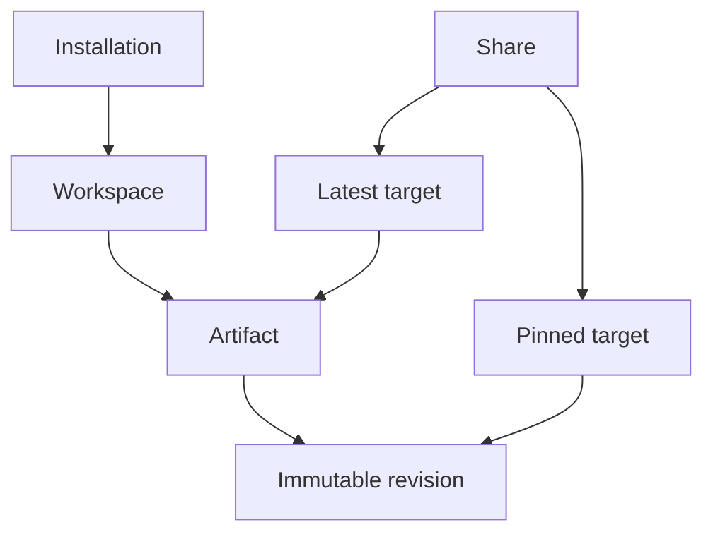
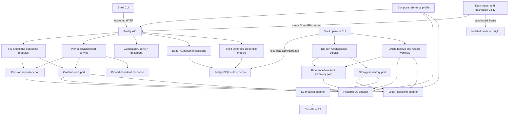
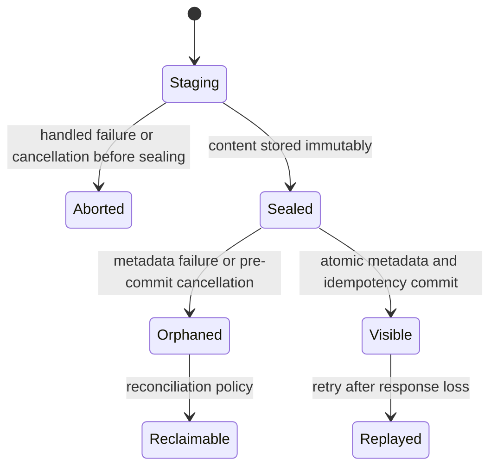

# Shelf - Plan

## Goal Capsule

- **Objective:** Make Shelf the fastest safe path from a local or agent-generated artifact to a durable, browsable link, while preserving immutable history and a self-hosted operating model.
- **Product authority:** This Product Contract owns the current user-facing behavior and scope. Technical planning may refine implementation details but must not silently change these product commitments.
- **Current implementation scope:** A TypeScript/Fastify API foundation, canonical HTTP/OpenAPI contracts, streamed file/folder publishing and stable artifact updates, mutable artifact naming, source-linked restore-as-latest, authorized catalog/history/tree reads, provider-neutral file/folder revision comparison, revocable latest/pinned shares, a dark content-first viewer with a separate active-HTML renderer, profile-backed short `shelf` publishing, a lightweight authenticated Artifacts/Access utility, safe byte-range delivery, durable PostgreSQL metadata, interchangeable local/R2 content storage, self-hosted human sessions, scoped CLI/agent credentials, a runnable single-host reference profile, provider-neutral read-only reconciliation, and offline host-native PostgreSQL/Local File backup with verified empty-target restore.
- **Open blockers:** None for the implemented foundation, artifact lifecycle, persistence, authentication, runnable-alpha, reconciliation, host-native recovery, revocable sharing/viewer, CLI profile/publish-to-link, and lightweight authenticated utility slices. Automated WebKit/Firefox qualification for the web surfaces remains open; current interactive qualification covers Chromium desktop and narrow layouts. Compose-volume and R2 recovery, destructive-cleanup policy, online/PITR policy, live R2 qualification, content-aware diff adapters, remaining resource policies, and entries T4-T5 and T7 remain open until their implementation slices begin.

---

## Product Contract

### Summary

Shelf will provide a durable home for versioned artifacts, centered on an agent-safe CLI that can publish a file or folder and return a browsable link quickly.
Artifacts may be files or folders and may be shared through stable links targeting the latest state or an exact revision. The dashboard is a lightweight utility for viewing and occasional management, not the primary creation workflow.

### Problem Frame

Artifacts produced by people and coding agents are often left in temporary directories, attached to conversations, or uploaded to services that flatten their history.
Updating the artifact commonly destroys the previous state, while preserving it usually requires manually naming copies or creating a repository that recipients cannot easily browse.

The missing workflow is not collaborative editing or general cloud storage.
It is a predictable way to publish an output, immediately receive a readable or shareable link, update it without losing history, and later inspect exactly what changed and who published it.

### Key Decisions

- **The product is named Shelf** (session-settled: user-approved — chosen over Blankstage and Exhibit A: Shelf is short, easy to pronounce, and describes a place that both stores and displays artifacts). Governs R1.
- **Shelf is a publishing workspace, not a temporary file drop** (session-settled: user-approved — chosen over expiry-first sharing: durable management, history, and organization are core). Governs R2-R7, R14-R17.
- **Shelf is open source and self-hostable** (session-settled: user-directed — chosen over a required proprietary service: anyone should be able to run and own an installation). Governs R22-R25.
- **The CLI is the primary product workflow and the dashboard is a supporting utility** (session-settled: user-directed — chosen after reviewing a Claude Artifact share: agents and people should be able to publish and share without navigating a management UI, while the dashboard remains available for browsing and occasional lifecycle work). Governs R14-R19 and R26.
- **Shelf has no collections** (session-settled: user-directed — grouping adds management breadth without helping the core publish-to-link job). A share targets one artifact's latest revision or one exact revision. Governs R9-R13 and R19.
- **Storage lifetime and sharing lifetime are independent.** A share may expire or be revoked without deleting the underlying artifact. Governs R10-R13.
- **Folder publishes are atomic snapshots.** A revision represents a complete directory state that actually existed, while comparisons can drill into changed files. Governs R3-R6.
- **Restore preserves history.** Restoring an earlier state creates a new latest revision rather than rewriting or deleting later revisions. Governs R5.

### Product Model



An installation contains isolated workspaces such as personal and work.
A workspace owns artifacts. An artifact owns immutable revisions, while a share is a revocable pointer to that artifact's latest revision or to one exact revision.

### Actors

- A1. **Owner:** Configures an installation, its workspaces, policies, and credentials.
- A2. **Publisher:** Primarily uses the CLI to create, update, and share artifacts; may use the dashboard for occasional management.
- A3. **Agent:** Publishes and manages artifacts non-interactively under scoped credentials.
- A4. **Viewer:** Opens a shared file, folder, or exact revision through a readable link.
- A5. **Operator:** Installs, upgrades, backs up, restores, and monitors a self-hosted deployment.

One person may act as the owner, publisher, viewer, and operator of a personal installation.

### Requirements

**Artifacts and revisions**

- R1. The product and its primary CLI are named Shelf.
- R2. Shelf must accept an individual file or a complete folder as an artifact without requiring a repository and must give the artifact a stable identity that survives renames and new revisions.
- R3. Publishing an artifact must create an immutable revision with its own stable URL, content hash, timestamp, publishing actor, and origin metadata available at publish time.
- R4. A folder revision must preserve the complete folder tree and allow viewers to browse it through a file-tree interface.
- R5. Restoring an earlier revision must create a new latest revision whose provenance points to the restored source revision.
- R6. Shelf must compare two revisions side by side and identify added, removed, moved, and changed files within folder revisions.
- R7. Shelf must render supported content and provide safe download behavior for content it cannot render.

**Organization and identity**

- R8. An installation must support separate workspaces for contexts such as personal and work, with independent settings and artifact namespaces.
- R9. **Retired:** Shelf intentionally has no collection abstraction.

**Sharing and lifecycle**

- R10. Artifacts must support private, unlisted, and public visibility; new artifacts are private by default, new shares are unlisted by default, and public search indexing is a separate opt-in setting.
- R11. A share must expose a stable URL, target either the latest state or an exact revision, and retain that targeting behavior for its lifetime.
- R12. Share expiry and revocation must stop access without deleting an otherwise retained artifact or revision.
- R13. Artifact retention, revision retention, and share-link retention must be configurable independently, with retained artifacts and revisions defaulting to no automatic expiry, pinned revisions protected from automated cleanup, and explicit deletion recoverable for 30 days before purge.

**Dashboard and automation**

- R14. The dashboard must remain a lightweight utility that lets an owner find and view workspaces, artifacts, revisions, and shares and perform occasional lifecycle management; it must not become a prerequisite for publishing or sharing.
- R15. Every non-administrative publishing and lifecycle operation must have a documented non-interactive CLI path. The dashboard may expose a useful subset and must consume the same public API.
- R16. The CLI must provide structured output, predictable exit behavior, scoped authentication, and idempotent publishing suitable for coding agents and automation.
- R17. CLI profiles must select an installation, credential, and default workspace without mixing personal and work environments.
- R18. Bulk import must create artifacts and links from a machine-readable manifest and report partial failures without hiding successful items.
- R19. Export must support one revision, one complete artifact history, or an installation-owned portable archive as permitted by the caller's scope.
- R26. After a profile selects the installation, credential, and default workspace, the common CLI workflow must accept a file or folder path, optionally request an unlisted share explicitly, and return canonical artifact, revision, and share URLs without prompting. Publishing without an explicit share request must remain private.

**Metadata and safety**

- R20. Shelf must distinguish server-observed provenance from publisher-supplied metadata, keep provenance immutable, and record later metadata edits as auditable events without presenting unverified claims as observed facts.
- R21. Active content must be isolated from Shelf's authenticated application and protected by configurable rendering, resource, and download policies.

**Open-source operation**

- R22. A self-hosted installation must provide a documented path for installation, upgrade, backup, restore, and administrative recovery.
- R23. Core publishing, browsing, versioning, sharing, import, and export must not require a proprietary hosted dependency.
- R24. A complete export must be sufficient to move owned artifacts, revisions, and metadata to another compatible installation.
- R25. A self-hosted process must expose minimal unauthenticated liveness and readiness probes outside `/api/v1`. Liveness reports only that the process is serving; readiness reports whether startup completed and required PostgreSQL and storage dependencies are usable, without exposing configuration, paths, credentials, cookies, or exception details.

### Key Flows

- F1. Publish a new artifact
  - **Trigger:** A publisher or agent selects a file or folder and a workspace.
  - **Actors:** A2 or A3
  - **Steps:** Shelf validates the input and policy, captures provenance, creates the artifact and first immutable revision, and returns its identifiers and links.
  - **Outcome:** Shelf returns durable artifact and revision URLs; when explicitly requested, it also returns an unlisted share URL. The artifact is available to the dashboard but publishing does not depend on it.
  - **Covered by:** R2-R4, R7, R15-R17, R20-R21, R26.

- F2. Update, compare, and restore
  - **Trigger:** A publisher republishes an existing artifact or selects an earlier revision.
  - **Actors:** A2 or A3
  - **Steps:** Shelf creates a revision, shows its changes against another revision, and optionally restores an earlier state as a new revision.
  - **Outcome:** Every state remains inspectable and the latest pointer advances without history being rewritten.
  - **Covered by:** R3-R6, R14-R16, R20.

- F3. Share and revoke
  - **Trigger:** A publisher creates a share for an artifact or exact revision, either directly or as an explicit publish option.
  - **Actors:** A2 or A3, followed by A4
  - **Steps:** The publisher selects visibility, target behavior, and optional expiry; Shelf returns a link; the viewer opens it; the publisher may later revoke it.
  - **Outcome:** Access follows the share policy while the underlying retained content remains independent.
  - **Covered by:** R10-R12, R15-R17, R21, R26.

- F4. Move content in or out
  - **Trigger:** An owner or publisher imports a manifest or requests an export.
  - **Actors:** A1, A2, or A3
  - **Steps:** Shelf validates scope, processes the requested items, preserves supported history and metadata, and returns a machine-readable result for every item.
  - **Outcome:** Content can move in bulk without hidden loss or lock-in.
  - **Covered by:** R18-R20, R24.

- F5. Apply lifecycle policy
  - **Trigger:** A retention deadline arrives or an owner requests deletion.
  - **Actors:** A1 or the installation
  - **Steps:** Shelf evaluates independent artifact, revision, and share policies; protects pinned revisions; revokes access when required; and exposes recoverable deletion state before permanent purge.
  - **Outcome:** Cleanup is predictable and never implies that share expiry equals content deletion.
  - **Covered by:** R12-R14.

### Acceptance Examples

- AE1. Latest and pinned shares
  - **Covers R11.**
  - **Given:** Revision 1 is shared once as latest and once as an exact revision.
  - **When:** Revision 2 is published.
  - **Then:** The latest share displays revision 2 and the pinned share continues to display revision 1.

- AE2. Restore without rewriting history
  - **Covers R3, R5.**
  - **Given:** An artifact has revisions 1, 2, and 3.
  - **When:** The publisher restores revision 1.
  - **Then:** Shelf creates revision 4 with revision 1's content and provenance identifying the restore; revisions 2 and 3 remain available.

- AE3. Expiring a share
  - **Covers R12-R13.**
  - **Given:** A retained artifact has a share that expires after seven days.
  - **When:** The share expires.
  - **Then:** The link stops revealing the artifact, while authorized users can still access its artifact and revision history.

- AE4. Folder comparison
  - **Covers R4, R6.**
  - **Given:** Two revisions of a folder contain added, removed, and modified files.
  - **When:** A viewer compares the revisions.
  - **Then:** The tree identifies each change and opens a side-by-side comparison where the file type supports one.

- AE5. Safe active content
  - **Covers R7, R21.**
  - **Given:** An HTML artifact contains scripts that attempt to access Shelf application credentials.
  - **When:** A viewer opens the artifact.
  - **Then:** The artifact may run only within its configured isolation boundary and cannot access the authenticated Shelf application context.

- AE6. Idempotent agent retry
  - **Covers R3, R16.**
  - **Given:** An agent publishes content and loses the response before recording the returned revision identifier.
  - **When:** The agent retries with the same idempotency identity and content.
  - **Then:** Shelf returns the original result instead of creating an indistinguishable duplicate revision.

- AE7. Portable history
  - **Covers R19, R24.**
  - **Given:** An owner exports an artifact with multiple revisions and imports it into a compatible installation.
  - **When:** The import completes.
  - **Then:** The destination preserves revision order, hashes, provenance, and metadata.

- AE8. Collections remain absent
  - **Covers R9.**
  - **Given:** A publisher wants to share several related outputs.
  - **When:** The publisher uses Shelf.
  - **Then:** Each artifact is published and shared independently; Shelf does not create a collection or group-level lifecycle.

- AE9. Rename without broken links
  - **Covers R2-R3, R11.**
  - **Given:** An artifact and one of its revisions have already been shared.
  - **When:** The owner renames the artifact and later publishes another revision.
  - **Then:** Existing artifact, revision, and share URLs remain valid and retain their original target behavior.

- AE10. Runnable single-host restart
  - **Covers R16, R22-R23, R25.**
  - **Given:** An empty PostgreSQL database and durable local-content volume.
  - **When:** The operator explicitly migrates, bootstraps the owner, issues a scoped credential, starts Shelf, publishes with the CLI, stops Shelf gracefully, and restarts with the same installation identity and volumes.
  - **Then:** Readiness reflects dependency state, the original pinned revision remains byte-exact, and revoked or invalid credentials remain denied.

### Success Criteria

- A human can publish a folder, receive a readable link, publish an update, compare it with the previous revision, and restore the earlier state without leaving the documented workflow.
- An agent can perform the same lifecycle non-interactively and parse every success and failure without scraping human-formatted output.
- With a configured profile, a human or agent can run the equivalent of `shelf publish ./idea.html --share` and receive canonical artifact, revision, and unlisted share URLs; omitting `--share` never exposes the artifact.
- A recipient can tell whether a link follows latest or is pinned and can browse a folder without downloading it first.
- Expiring or revoking a share never silently deletes retained content.
- An operator can back up and restore an installation and can export owned content without depending on the original deployment remaining available.
- An operator can explicitly migrate and initialize the reference single-host profile, publish through the real CLI, stop it gracefully, restart it with the same volumes, and retrieve the original pinned bytes.
- Technical planning can reference stable requirement and acceptance IDs without inventing product behavior.

### Scope Boundaries

**Deferred for later**

- Inline annotations, anchored comments, and general discussion threads.
- Live analytics beyond the minimum operational and audit information needed to manage shares safely.
- Custom domains and domain-specific branding.
- Public profile pages and broader discovery surfaces.
- Multi-user teams, role-heavy collaboration, and hosted multi-tenant operation.
- Real-time artifact previews and automatically updating already-open viewer sessions.

**Outside this product's identity**

- A collaborative document editor.
- A Git replacement with branching, merging, and source-control semantics.
- A general-purpose device synchronization drive.
- A mandatory hosted service that controls access to a self-hosted installation.

### Dependencies and Assumptions

- The first useful release targets one owner with multiple isolated workspaces; team accounts remain deferred.
- Folder publishes use whole-folder snapshots so a revision always represents a real publishable state.
- Shelf has no collection abstraction; related artifacts are shared independently.
- The first renderer allowlist and interface foundation are accepted under T6 and T8; unsupported or disallowed formats remain downloadable.
- Shelf-owned web surfaces have one dark theme. An isolated authored HTML artifact retains its own presentation rather than being rewritten by Shelf.

### Outstanding Questions

**Deferred to Planning**

- CLI packaging and distribution channels.
- Deployment targets beyond the single-host reference profile and the minimum backup contract.
- Content-aware diff adapters and resource limits beyond the first renderer envelope.
- Password-protected share behavior and its relationship to authenticated access.

### Sources

- [Decision register](../decisions/README.md) tracks which product and technical choices are accepted, provisional, deferred, or open.
- [TypeScript server framework comparison](../research/2026-08-17-typescript-server-framework-comparison.md) compares the current server-framework field against Shelf's upload and API constraints.
- [Persistence and content-storage comparison](../research/2026-08-17-persistence-and-content-storage-comparison.md) compares the metadata, query-builder, and content-provider choices behind T2.
- [Authentication stack comparison](../research/2026-08-17-authentication-stack-comparison.md) compares self-hosted human identity and machine-credential approaches behind T3.
- [Claude Artifact reference](https://claude.ai/code/artifact/5af6218c-feb3-4979-b280-d48c3af13c9a?via=auto_preview) demonstrates the content-first shared-view pattern: minimal product chrome, an explicit user-generated-content trust label, and lifecycle actions outside the artifact canvas.
- [Docker Compose startup-order guidance](https://docs.docker.com/compose/how-tos/startup-order/) defines health-gated dependencies and one-shot prerequisite completion for the reference profile.
- [Fastify server lifecycle](https://fastify.dev/docs/latest/Reference/Server/) defines listen, connection draining, and close behavior used by the production process.

---

## Planning Contract

**Product Contract preservation:** Requirements retain stable IDs. R9 is explicitly retired rather than reused after collections were removed; R10, R14-R15, R19, and R24 are narrowed accordingly. R26 records the CLI-first publish-and-share target without representing it as implemented. Earlier R22-R25 and AE10 operational changes remain intact.

**Technical decision status:** T1-T3, the narrow T4a CLI profile/configuration contract, T6, T8, and the narrow T5a-T5c reference, reconciliation, and host-native recovery profiles are accepted. T4 CLI packaging and distribution beyond T4a, the remainder of T5 deployment, T7 bulk formats, and content-aware diff adapters under P1 remain open in the [decision register](../decisions/README.md).

### Key Technical Decisions

- KTD1. **Use a TypeScript service-first modular monolith.** (session-settled: user-approved — chosen over a Go core and a Next.js-centered backend: one language reduces early coordination cost while a stable HTTP contract prevents framework lock-in.) Use Node.js 24 LTS, TypeScript 7, and pnpm workspaces. Keep deployable processes and shared packages separate without adding a build orchestrator until measured build pressure justifies one. Governs R14-R19 and implements accepted T1.
- KTD2. **Use Fastify 5 as the API framework.** Fastify ranked above Hono, AdonisJS, NestJS, Elysia, Express 5, and Nitro for Shelf because streamed multipart parts, granular limits, JSON Schema, OpenAPI generation, logging, lifecycle hooks, and request injection are first-class paths on Node.js. A failed streaming validation slice reopens this choice before persistence work begins. Governs R2-R3, R7, R15-R16, and R20.
- KTD3. **Make versioned REST and OpenAPI the compatibility boundary.** Canonical runtime schemas in `packages/contracts` drive Fastify validation and serialization, which generate the OpenAPI document consumed by external clients. The CLI and future dashboard consume `/api/v1`; they may import contracts but never `packages/core` or server modules. Contract generation and drift checks are part of verification. Governs R15-R19 and R24.
- KTD4. **Seal content before one atomic metadata commit makes a revision visible.** The application service stages and hashes input, seals immutable content, then asks the revision repository to atomically commit artifact creation or lookup, revision creation, latest-pointer advancement, and the successful idempotency result. Metadata failure may leave an unreachable sealed-content orphan for reconciliation, but no visible revision may reference missing or mutable bytes. An idempotency record is namespaced by installation, workspace, authenticated actor, operation, and client key; keys in different namespaces never collide or disclose results across actors. Within that namespace, a versioned fingerprint covers content hash, original file name, media type, and canonically encoded publisher metadata. Identical fingerprints replay the committed result and changed semantic inputs conflict. Governs R3, R16, R20, and AE6.
- KTD5. **Keep active content off the authenticated application origin.** The first slice serves pinned bytes as downloads with MIME-sniffing protection and range support. Inline active rendering remains disabled unless T5-T6 provide a distinct renderer origin with no application credentials and an independently enforceable resource policy; a single-origin installation remains download-only. Governs R7, R21, and AE5.
- KTD6. **Use one machine contract across API and CLI.** Success includes workspace, artifact, revision, content hash, byte count, provenance classification, request ID, canonical paths, and replay status. Public artifact and revision identifiers are server-generated opaque values with at least 128 bits of cryptographic entropy; request IDs are also server-generated and untrusted inbound correlation values never replace them. Errors include a stable code, retryability, field details where applicable, and request ID, but never internal exceptions, stack traces, storage paths, credentials, or secret-bearing links. API codes map to stable CLI exits: `1` unexpected, `2` usage, `3` authentication, `4` authorization, `5` validation or idempotency conflict, and `6` transient network or service failure. The first CLI slice emits exactly one JSON document by default: success on standard output, errors on standard error. Any later human-oriented format must be an explicit opt-in and cannot weaken this default. Governs R15-R17.
- KTD7. **Use PostgreSQL metadata with provider-neutral content storage.** (session-settled: user-approved — chosen after comparing PostgreSQL/SQLite, Kysely/Drizzle/Prisma, local files, Google Drive, generic S3, and Cloudflare R2.) Kysely and `pg` implement the PostgreSQL repository and reviewed migrations. A production local-filesystem adapter supports the single-host self-hosted profile, while one generic S3-protocol adapter is configured first for R2. Revisions persist opaque content IDs, hashes, and byte counts rather than provider paths or ETags. AWS S3 may reuse the adapter after conformance testing; a native GCP or other provider may implement the same core ports. R2 remains optional, so core product behavior has no mandatory proprietary dependency. Governs R3, R16, R22-R24 and implements accepted T2.
- KTD8. **Separate human sessions from Shelf authorization and agent credentials.** (session-settled: user-approved — chosen after comparing Better Auth, Clerk, Auth.js, Stack Auth/Hexclave, ZITADEL, Keycloak, and Ory.) Better Auth core owns the local human identity, password, cookie, and revocable PostgreSQL session mechanics behind the Fastify authentication seam. Shelf owns stable human/service actors, high-entropy opaque access credentials, relational workspace/action grants, rotation, revocation, last-use state, and authentication audit events. Raw access secrets are revealed once and never stored; browser sessions never become CLI bearer credentials. Better Auth Organizations and machine-token plugins remain disabled because Shelf workspaces, provenance actors, and credential grants are product-domain state. Generated Better Auth SQL is pinned and reviewed through explicit migrations, never applied implicitly during API startup. Governs R8, R14-R17, R20, and R22-R24 and implements accepted T3.
- KTD9. **Make the proven path runnable before expanding product breadth.** (session-settled: user-approved — chosen over building folders or the dashboard next: the existing single-file path should be installable and operable before more product surfaces depend on it.) Ship Docker Compose as the first reference profile with one production Fastify process, PostgreSQL, and a durable local-content volume. Keep migrations, owner bootstrap, and access-credential administration as explicit host-local commands; keep the portable `shelf` CLI a remote `/api/v1` client. This implements accepted T5a without claiming complete T5 production readiness. Governs R15-R16 and R22-R25.
- KTD10. **Separate reconciliation observation from destructive cleanup.** (session-settled: user-approved — chosen before backup and broader artifact behavior: operators need to see metadata/storage drift without granting the first tool permission to delete.) Add provider-neutral referenced-content and storage-inventory ports, classify missing or size-mismatched references immediately, and age-gate unreferenced sealed objects plus staging before reporting them as candidates. Expose only a host-local JSON dry run under T5b. Any later deletion command must perform a fresh metadata check, retain an independent age gate, and remain separately disableable. Governs R22-R25 and KTD4/KTD7.
- KTD11. **Make the first recovery path offline, manifest-driven, and non-destructive.** (session-settled: user-approved — chosen before destructive reconciliation cleanup: a recovery drill must prove PostgreSQL and immutable content can be restored together.) Under T5c, require the operator to confirm the exact installation has no active writers; create a PostgreSQL custom dump, complete Local File archive, archive checksums, and a versioned manifest derived from independently hashed referenced content. Restore only into an empty database and absent content root, use one PostgreSQL restore transaction, and re-hash every referenced object before success. Keep R2/provider recovery, Compose named-volume orchestration, online/PITR policy, and portable export separate. Governs R22-R24 and KTD4/KTD7/KTD10.
- KTD12. **Make stable artifact identity useful before adding folders or the dashboard.** (session-settled: user-approved — chosen after U13: the current single-file publish path must support subsequent immutable revisions and discovery before broader product surfaces depend on it.) Keep artifact creation and publishing another revision as distinct versioned HTTP operations. A revision publish names the stable opaque artifact ID and workspace explicitly; PostgreSQL locks that artifact while assigning a strictly increasing revision number and advancing its latest pointer in the same transaction. Authorized artifact list, detail, and history reads use deterministic bounded cursor pagination through core ports; the portable CLI consumes only those public contracts. Reuse `file.publish` and `revision.read` grants. Defer rename, restore, folders, comparisons, shares, and dashboard behavior. Governs R2-R3, R14-R16, R20, F1-F2, AE6, and AE9.
- KTD13. **Keep mutable artifact presentation separate from immutable revision truth.** (session-settled: user-approved — chosen for U15 after stable history: rename and restore should complete the first file lifecycle without changing identifiers, old descriptors, or stored bytes.) Give each artifact a mutable display name initialized from its first revision filename; later revision filenames remain immutable and never rename the artifact implicitly. Rename updates only artifact presentation and ordering state. Restore creates a new revision that reuses the verified source revision's immutable content descriptor, filename, media type, and publisher metadata while recording server-observed `revision.restore` provenance and its source revision. PostgreSQL locks the artifact and atomically assigns the next number, advances latest, and records operation-scoped idempotency without writing content again. Restore requires both `file.publish` and `revision.read`; rename uses `file.publish`. Defer finer-grained lifecycle grants, rename audit events, comparisons, folders, shares, and dashboard behavior. Governs R2-R5, R14-R16, R20, F2, AE2, and AE9.
- KTD14. **Represent a folder revision as a canonical manifest over independently sealed entries.** (session-settled: user-approved — chosen for U16 after the file lifecycle: archive-only storage would make tree reads, restore, reconciliation, backup, and later comparison depend on repeatedly unpacking one opaque blob.) A `shelf-folder-manifest/v1` object lists every directory and regular file in deterministic UTF-8 byte order. File entries carry a server-computed immutable content descriptor; empty directories remain explicit. The manifest itself is canonically encoded, hashed, and sealed, while PostgreSQL atomically commits the revision, its complete entry set, the latest pointer, and idempotency result. Folder paths are NFC-normalized relative POSIX paths. Reject absolute paths, empty/dot/parent segments, backslashes, controls, segments over 255 UTF-8 bytes, paths over 1,024 UTF-8 bytes or 64 segments, Windows-reserved characters/names or trailing dots/spaces, normalization/case-insensitive collisions, symlinks, and special files. The first bounded defaults are 1,000 files, 2,000 total entries, 10 MiB per file, 100 MiB aggregate file bytes, and a 2 MiB transport manifest; future operator configuration may lower them but cannot bypass canonical-path validation. Restoring a folder copies its immutable manifest and entry references without writing content. Descriptor comparison is governed by KTD15; broader revision/bandwidth policy remains open. Governs R2-R7, R15-R16, R20, R23-R24, F1-F2, and AE4.
- KTD15. **Compare immutable descriptors before choosing content diff adapters.** (session-settled: user-approved — chosen for U17 after folder snapshots: structural comparison must behave identically on Local File, R2, and future providers and should not force renderer architecture.) Compare only two revisions of the same artifact and kind. File results expose exact content-hash/byte-count, media-type, and original-name changes. Folder results compare complete entry sets, return a full summary plus at most 100 deterministic changed entries per cursor-bound page, and identify a move only when one removed file and one added file uniquely share the same content hash and byte count. Ambiguous duplicate identities remain additions/removals rather than inferred moves. Comparison authorizes immutable metadata reads and never opens content storage. Defer content-aware line/image/binary diffs, dashboard side-by-side presentation, renderer isolation, and interface component selection to P1 and T6/T8. Governs R6, R15-R16, R22-R24, and AE4 and implements accepted T10.
- KTD16. **Keep share capabilities out of request URLs and raw storage.** (session-settled: user-approved — chosen for U18 over a single opaque path token: share links must survive idempotent response replay without entering access logs, referrers, or plaintext metadata.) Give a share a stable opaque public ID and derive its verifier through an injected capability codec backed in production by a dedicated installation secret. Canonical links use `/s/<share-id>#<verifier>`; the fragment is exchanged through fixed anonymous POST routes and scrubbed from the visible location after tab-scoped recovery state is established. Create is idempotent over actor, workspace, client key, artifact, target policy, pinned revision, and expiry, so replay returns the same URL without storing the verifier. Invalid, revoked, expired, malformed, and cross-scope capabilities collapse to one public not-found result. Management responses other than authorized create/replay do not expose the verifier. Governs R10-R12, R15-R17, R21, R26, F3, AE1, AE3, and AE5.
- KTD17. **Build one dark web client and a separate active-content renderer.** (session-settled: user-directed — chosen over a themeable dashboard and same-origin preview: Shelf should stay minimal and dark while authored active content cannot share the authenticated trust context.) Use React Router Data Mode, Tailwind CSS 4 semantic tokens, direct Base UI primitives, Geist Sans/Mono, and CSS-first reduced motion in `apps/web`; do not add Motion, a shared UI package, shadcn blocks, beUI components, or specialized tree/diff libraries without a demonstrated need. The first passive allowlist is escaped UTF-8 text/source/JSON, sanitized Markdown without raw HTML, raster images, and folder trees. Self-contained HTML runs only through `apps/renderer` on a separately configured origin, with no application authentication secret and no same-origin, form, popup, download, or top-navigation privileges. CSP blocks fetch, XHR, and subresource egress. A private runtime completion channel lets the parent reject a parse-time replacement and blank every later iframe navigation; Chromium may still issue one own-frame navigation request before termination, so strict zero-egress installations keep HTML download-only. SVG, PDF, other active media, and unknown binaries remain downloads. Governs R7, R14-R15, R21, AE5, and implements accepted T6/T8.
- KTD18. **Make CLI profiles explicit authority, not ambient field precedence.** (session-settled: user-approved — chosen for U19 after the public share boundary: the short publish path must not trade convenience for personal/work context bleed or plaintext credentials.) Store versioned profile configuration in the platform-standard per-user config directory. A profile binds one installation origin, workspace, insecure-loopback policy, and either a native-keyring reference or explicitly named environment variable; it never contains the credential. Use the reserved `default` profile only when `--profile` is absent. A complete legacy `--url`/`--workspace` plus `SHELF_TOKEN` context remains supported, but profile and legacy fields never mix. Refuse symlinked state, use owner-only directories/files and atomic replacement, and fail closed when the requested credential backend is unavailable. Keep generated idempotency keys and non-secret committed identifiers in a bounded local operation journal so response-loss retries and publish-then-share partial failures remain machine-readable; never journal a token or capability-bearing share URL. This implements T4a while leaving installation packages and release channels open under T4. Governs R15-R17, R26, F1, F3, and AE6.

### High-Level Technical Design



The API owns transport, limits, authentication context, cancellation signals, range parsing, HTTP error mapping, and provider selection during assembly. The application services own idempotency, immutable revision creation and lookup, provenance classification, and revision visibility. Core never imports PostgreSQL, filesystem, S3, or R2 modules.



Cancellation is authoritative before the metadata commit begins. Once the commit linearizes, cancellation may suppress the response but cannot delete the revision or its content; an idempotent retry discovers the committed result.

### Output Structure

```text
apps/
  api/
  cli/
packages/
  auth/
  contracts/
  core/
  postgres/
  storage/
docs/
  decisions/
  operations/
  plans/
  research/
```

The web workspace enters scope with U18's anonymous viewer. Authenticated dashboard routes remain sequenced after U19 so the CLI publish-to-link path stays primary.

### Assumptions

- File publishing retains its one-file multipart contract. Folder publishing uses a separate manifest-first multipart operation so folder path identity cannot be inferred from multipart filenames and bulk-import semantics do not leak into this slice.
- Injectable memory and temporary-content adapters remain test and local-development infrastructure. Production assembly uses PostgreSQL plus either local content storage or the R2 configuration of the S3 adapter.
- Human sessions and Shelf access credentials converge only at the HTTP authentication-context seam. Test authenticators remain injection-only fixtures; production startup must construct the accepted T3 adapters and may never invent a default actor or select a test bypass.
- Publisher metadata participates in the idempotency request fingerprint because changing initial metadata changes the semantic publish request.
- The v1 streamed multipart transport permits one optional `publisherMetadata` JSON field before the required file part. This ordering keeps the core semantic request fixed before it consumes a one-pass stream; a late or duplicate field is a canonical validation error, while metadata object property order does not affect the fingerprint.
- The PostgreSQL adapter makes idempotent replay durable across application restarts. Its eventual retention window remains a T5 operational policy before release.
- Dependency major lines are recorded in T1, while exact versions are pinned by the lockfile and may receive compatible updates after normal verification.

### Sequencing

Build the contracts and core service before transport adapters. Add the Fastify route after the application boundary is testable. Add pinned delivery after staged content can be addressed immutably. Keep the portable CLI a client of the public API. After persistence and authentication are proven, add a production composition root, host-local administration, and the single-host reference profile. U18-U20 preserve that sequencing: share primitives and the short CLI publish-to-link flow shipped before the authenticated utility. Further work returns to explicit retention/deletion, portability, and operational decisions rather than expanding dashboard chrome.

### Product Delivery Roadmap

1. **Runnable single-host alpha:** Production assembly, explicit configuration and migrations, health probes, graceful shutdown, owner/credential operator commands, a non-root image, Docker Compose with durable PostgreSQL/local-content volumes, and a real restart smoke path.
2. **Operational durability:** Read-only staging/orphan reconciliation and host-native PostgreSQL/Local File backup/restore are implemented first; Compose-volume and R2 recovery, online/PITR policy, destructive cleanup policy, upgrade contract, administrative password recovery, reverse-proxy/TLS qualification, and live R2 conformance complete the remainder of T5.
3. **Artifact lifecycle breadth:** Stable file updates, artifact list/detail/history, mutable naming, restore-as-latest, atomic folder snapshots, portable path rules, the first folder limits, and provider-neutral structural revision comparison are implemented.
4. **Share primitives and content-first viewing:** Latest and pinned share creation, revocation and expiry, explicit trust labeling, renderer isolation, supported formats, and a viewer where artifact content occupies the page are implemented.
5. **Fast CLI path:** Profile-backed installation/workspace selection and an explicit `shelf publish ./path --share` workflow return machine-safe artifact, revision, and share URLs while keeping ordinary publishes private. Portable distribution beyond the repository remains open under T4.
6. **Dashboard utility:** Sign-in, workspace and artifact browsing, history/restore controls, shares, and credential administration through product APIs without making the dashboard part of the common publish path.
7. **Portability and operations:** Bulk import/export, backup-compatible complete export, deployment templates, remaining recovery work, and additional qualified content providers.

### System-Wide Impact

- **Dependency direction:** API and CLI may depend on contracts; API adapters may depend on core ports; core never imports Fastify, Commander, filesystem adapters, or CLI modules. Pinned reads go through a framework-independent read service rather than directly from a route to a storage adapter.
- **Context propagation:** Workspace, actor, request ID, idempotency identity, fingerprint version, publisher metadata, server-observed provenance, and cancellation context cross the HTTP/application boundary explicitly. Logs and errors must not expose credentials or secret-bearing share URLs.
- **Write lifecycle:** Staging is non-readable. Sealed content is immutable. The atomic metadata commit is the only revision-visibility point and includes the idempotency result. Sealed but unreferenced content is an orphan eligible for later reconciliation; referenced content is never cleanup-eligible.
- **Failure ownership:** Handled pre-commit failures and cancellations clean request-owned staging. Process crashes may leave quarantined staging or sealed orphans; age-gated reconciliation and the host-native recovery drill exist, while deletion policy plus Compose/R2 recovery remain mandatory T5 work before production release.
- **Contract parity:** Runtime schemas are the generation source for OpenAPI and the CLI's wire validation. This slice requires API/CLI parity for publishing; pinned byte delivery is a viewer/API operation until a CLI download command enters scope.
- **Operational boundary:** `/health/live` and `/health/ready` are the only unauthenticated operational routes. They remain outside `/api/v1`, are hidden from product OpenAPI, and return stable non-secret state only.
- **Trust boundary:** The application origin remains download-only for active formats. A later renderer must use a separate origin and policy boundary rather than relaxing application-origin protections.

### Risks and Reversal Triggers

- Reopen KTD2 if the Fastify slice cannot stream multipart input with bounded memory, propagate cancellation, enforce limits, and clean partial content without framework escape hatches.
- Reopen the shared contract approach if emitted OpenAPI cannot represent the actual multipart request, error envelopes, or range-download responses without hand-maintained duplicate schemas.
- Reopen the core port design if it requires a distributed transaction, leaks storage-specific finalization into transport code, or cannot express object-store range reads without coupling core to HTTP.
- Reopen KTD7 if PostgreSQL cannot preserve cross-process replay/conflict semantics or a content adapter cannot stream, seal immutably, serve exact ranges, and clean handled failures. Provider recovery and orphan garbage collection must land under T5 before production release; T5c does not qualify R2 or Compose named-volume recovery.
- Reopen KTD8 if Better Auth cannot compile and run on the accepted Node.js/TypeScript/Fastify/PostgreSQL stack, if immediate session revocation cannot be proven, or if the Shelf credential module cannot enforce cross-process revoke/use and workspace denial without leaking secrets.
- Production startup must assemble only PostgreSQL, the configured production content adapter, Better Auth, and Shelf authorization. It may never select memory persistence, temporary storage, a test authenticator, a default actor, implicit migrations, or implicit bootstrap.
- Reopen KTD14 if a supported storage adapter cannot preserve independently addressable immutable entry objects, PostgreSQL cannot expose a complete entry set atomically, or the portable path rules reject ordinary cross-platform projects without closing a real ambiguity or traversal risk.

---

## Implementation Units

### U1. Establish the TypeScript workspace

- **Goal:** Create the minimal pnpm workspace, strict TypeScript configuration, formatting, build, and test commands required by the API, CLI, contracts, and core packages.
- **Requirements:** Enables R14-R19 and accepted T1 without implementing dashboard behavior.
- **Dependencies:** None.
- **Files:** `.gitignore`, `README.md`, `docs/decisions/README.md`, `package.json`, `pnpm-workspace.yaml`, `pnpm-lock.yaml`, `tsconfig.base.json`, `biome.json`, `apps/api/package.json`, `apps/api/tsconfig.json`, `apps/api/src/index.ts`, `apps/cli/package.json`, `apps/cli/tsconfig.json`, `apps/cli/src/index.ts`, `packages/contracts/package.json`, `packages/contracts/tsconfig.json`, `packages/contracts/src/index.ts`, `packages/core/package.json`, `packages/core/tsconfig.json`, `packages/core/src/index.ts`.
- **Approach:** Record accepted T1 in the decision register, synchronize the README, and pin the current compatible major lines from T1. Use package export maps and project references or equivalent workspace build boundaries. Do not add the dashboard workspace, a task orchestrator, persistence packages, or deployment configuration.
- **Execution note:** This is scaffolding; prefer install, type-check, and package-boundary smoke verification over artificial unit tests.
- **Patterns to follow:** T1 and KTD1; there is no pre-existing source pattern.
- **Test scenarios:** Test expectation: none -- this unit creates tooling and package boundaries without product behavior.
- **Verification:** A clean install resolves one lockfile; every workspace type-checks; root scripts address formatting, tests, type checking, and builds without undeclared cross-package imports.

### U2. Define contracts and immutable publish behavior

- **Goal:** Define the versioned machine contracts and implement the framework-independent publish application service behind storage and revision ports.
- **Requirement slices advanced:** R2-R3, R15-R16, R20, AE6, and the publish-and-return portion of F1; carries workspace identity for R8 without implementing workspace settings or lifecycle.
- **Dependencies:** U1.
- **Files:** `packages/contracts/src/index.ts`, `packages/contracts/src/publish.ts`, `packages/contracts/src/errors.ts`, `packages/contracts/test/contracts.test.ts`, `packages/core/src/index.ts`, `packages/core/src/errors.ts`, `packages/core/src/publishing/publish.ts`, `packages/core/src/publishing/ports.ts`, `packages/core/test/publish.test.ts`.
- **Approach:** KTD3, KTD4, and KTD6 own the public and application rules. Keep workspace and actor identity explicit and authorize each action against that workspace through a framework-independent port. Treat server observations and publisher claims as separate bounded string metadata that consumers never interpret as markup or paths. Keep production persistence details behind ports.
- **Execution note:** Implement the application behavior test-first, beginning with idempotent replay and conflicting reuse of an idempotency key.
- **Patterns to follow:** Product model terminology and KTD3-KTD6.
- **Test scenarios:**
  - Publish a new file request and return one artifact and immutable revision with the server-computed hash, byte count, provenance classification, workspace, request ID, and replay status.
  - Covers AE6. Repeat the same scoped idempotency key and fingerprint and return the original identifiers without a second visible revision.
  - Reuse the same key in the same namespace with different bytes, original file name, media type, or publisher metadata and return a stable non-retryable conflict.
  - Use the same client key in a different workspace, actor, or operation namespace and create an independent result without revealing or conflicting with another namespace.
  - Canonicalize semantic inputs so multipart boundary, field order, and metadata property order do not change the versioned fingerprint.
  - Race identical and conflicting requests for one scoped key; commit one result, replay identical contenders, and reject conflicting contenders.
  - Fail immediately before and after content sealing and immediately before and after the atomic metadata commit; expose no broken revision and retain replayability after commit.
  - Fail content staging or abort the input and leave no visible artifact, revision, or successful idempotency record.
  - Reject publisher values that attempt to populate server-observed provenance fields or exceed the configured metadata key-count, key-length, or value-length limits.
  - Generate non-sequential opaque artifact and revision identifiers with the entropy required by KTD6.
- **Verification:** Unit tests prove the application boundary without importing Fastify or filesystem implementation details.

### U3. Add streamed HTTP publishing

- **Goal:** Expose the publish service through a versioned Fastify route that streams multipart file data, enforces limits, emits OpenAPI, and cleans failed staging.
- **Requirement slices advanced:** R2-R3, R7, R15-R16, R20, AE6, and the publish-and-return portion of F1; the dashboard outcome remains deferred.
- **Dependencies:** U2.
- **Files:** `apps/api/src/app.ts`, `apps/api/src/authenticate.ts`, `apps/api/src/generate-openapi.ts`, `apps/api/src/request-cancellation.ts`, `apps/api/src/routes/publish.ts`, `apps/api/src/plugins/errors.ts`, `apps/api/src/adapters/temporary-content-store.ts`, `apps/api/src/adapters/memory-revision-repository.ts`, `apps/api/openapi/v1.json`, `apps/api/test/publish.integration.test.ts`, `apps/api/test/openapi.contract.test.ts`, `apps/api/test/streaming-memory.mjs`.
- **Approach:** Register canonical contract schemas before routes so the OpenAPI document is generated from the validated transport contract and checked at `apps/api/openapi/v1.json`. Authenticate through the injected HTTP context and authorize the actor for the requested workspace and publish action. Pass the consumed multipart stream and cancellation signal into the application service, which owns staging, hashing, sealing, and the visibility decision. Derive temporary storage paths only from server-generated identifiers or hashes, use restrictive file permissions, and treat supplied file names only as validated metadata. Map disconnects, limits, validation failures, and conflicts into the canonical error envelope.
- **Execution note:** Start with failing injection tests for the request, response, and cleanup contract. Add a real socket-level cancellation test because request injection alone cannot prove disconnect behavior.
- **Patterns to follow:** KTD2-KTD4 and Fastify's official multipart, schema, Swagger, and injection APIs cited by the framework comparison.
- **Test scenarios:**
  - Stream a valid file and metadata without materializing the full payload in the route, then return the canonical publish result.
  - Accept missing `Content-Length` while enforcing the configured byte, file-count, field, and total-part limits.
  - Reject empty, duplicate-file, over-limit, truncated, malformed, and unexpected-part requests without a visible revision or leftover staged content.
  - Reject unauthenticated and cross-workspace publish attempts without staging any bytes.
  - Publish a traversal-shaped supplied file name and verify no write can escape the configured staging root.
  - Cancel a live upload and verify that staging is aborted and cleaned.
  - Cancel after content sealing but before metadata commit and expose no revision; preserve the sealed orphan for reconciliation rather than deleting referenced content speculatively.
  - Cancel at or after metadata commit and recover the committed revision through idempotent replay.
  - Covers AE6. Lose the first response after commit, retry the same request, and receive the original result marked as a replay.
  - Reuse the idempotency key with changed semantic input and receive the canonical conflict envelope.
  - Generate OpenAPI containing stable operation identifiers plus the versioned publish operation and canonical result/error schemas; fail verification when generated output drifts.
- **Verification:** Integration tests prove multipart streaming and cleanup across real adapters; a socket-level test proves cancellation; the generated OpenAPI artifact matches the checked contract.

### U4. Add pinned byte-range delivery

- **Goal:** Serve the exact revision bytes through a download-safe endpoint with conditional and single-range support.
- **Requirement slices advanced:** R3, R7, R21, and AE5. Stable share URLs and latest-versus-pinned share resolution remain deferred with R11 and AE1.
- **Dependencies:** U3.
- **Files:** `packages/contracts/src/errors.ts`, `packages/contracts/src/revisions.ts`, `packages/contracts/test/contracts.test.ts`, `packages/core/src/publishing/ports.ts`, `packages/core/src/revisions/read.ts`, `packages/core/test/read-revision.test.ts`, `apps/api/src/app.ts`, `apps/api/src/authenticate.ts`, `apps/api/src/adapters/temporary-content-store.ts`, `apps/api/src/plugins/errors.ts`, `apps/api/src/routes/revisions.ts`, `apps/api/openapi/v1.json`, `apps/api/test/openapi.contract.test.ts`, `apps/api/test/revisions.integration.test.ts`.
- **Approach:** Resolve the requested immutable revision through a core read service and content-reader port. Require an authenticated actor authorized for the revision's workspace; anonymous share-token reads remain deferred. The Fastify route owns HTTP range and conditional semantics but never imports the filesystem adapter. Use the server-computed hash as a strong entity tag. Serve bytes as an attachment with MIME-sniffing protection from the application origin. Sanitize and RFC 6266-encode publisher-supplied attachment names, with a server-generated fallback. Reject unsupported multi-range requests explicitly rather than merging ranges or returning latest content.
- **Execution note:** Implement request semantics test-first, including conditional and unsatisfiable range cases.
- **Patterns to follow:** KTD3 and KTD5.
- **Test scenarios:**
  - Download a complete pinned revision and verify its bytes, length, content hash entity tag, and attachment headers.
  - Request a revision without credentials or from another workspace and receive the canonical authentication or authorization error without streaming bytes.
  - Request the first, middle, suffix, and open-ended valid single ranges and receive the exact byte subset with correct range metadata.
  - Request an unsatisfiable or syntactically invalid range and receive a stable error without streaming unrelated bytes.
  - Send a matching conditional entity tag and receive no body.
  - Request active HTML and verify that it is not rendered inline from the authenticated application origin.
  - Publish a file name containing path separators, control characters, and quotes and verify the attachment header cannot inject a header or expose a path.
  - Attempt a multi-range request and receive the documented unsupported response.
  - Generate OpenAPI containing the pinned-revision operation and its range, conditional, and error responses; fail when it drifts from `apps/api/openapi/v1.json`.
- **Verification:** HTTP integration tests cover full, conditional, range, invalid, and content-safety behavior against an immutable revision.

### U5. Add the agent-safe CLI client

- **Goal:** Implement a non-interactive `shelf publish` command that calls `/api/v1`, streams a local file, and preserves the canonical result and error semantics.
- **Requirement slices advanced:** R15-R16, AE6, and the CLI-addressable publish portion of F1. CLI profiles and the full R17 behavior remain deferred.
- **Dependencies:** U3.
- **Files:** `apps/cli/src/index.ts`, `apps/cli/src/commands/publish.ts`, `apps/cli/src/client.ts`, `apps/cli/src/output.ts`, `apps/cli/test/publish.test.ts`, `apps/cli/test/e2e.test.ts`.
- **Approach:** Use Commander only for parsing and help. Keep HTTP behavior in a reusable client module. Require an explicit installation URL, workspace, file path, and idempotency key until profiles are implemented. The test credential comes only from `SHELF_TOKEN`, is never accepted as a literal argument or query parameter, and is never printed. Reject non-HTTPS remote URLs; loopback HTTP requires an explicit development-only opt-in, and redirects never forward credentials across origins. These are secret-transport safeguards, not a decision on T3's production credential representation. Never create a share or change visibility as a publish side effect.
- **Execution note:** Begin with the machine-output and exit-class tests; human-oriented output must not weaken the JSON contract.
- **Patterns to follow:** KTD3 and KTD6.
- **Test scenarios:**
  - Publish a readable local file through a live test API and emit one parseable JSON document whose identifiers, hash, byte count, workspace, request ID, provenance classification, and replay status match the API response.
  - Retry after a simulated lost response and report the original revision as an idempotent replay.
  - Reject missing or invalid arguments without making a request and return the usage exit class.
  - Map authentication, authorization, validation/conflict, transient service, and unexpected errors to distinct documented exit classes while preserving one canonical error document on standard error.
  - Reject insecure remote transport before sending a credential, never forward a credential across origins, and keep the credential absent from all success and error output.
  - Fail a local read or network connection without printing a false success document.
  - Reject any CLI dependency on `packages/core` or API server modules; wire behavior is validated from `packages/contracts` and the generated OpenAPI fixture.
  - Never prompt in non-interactive mode and never infer a workspace, public visibility, or share creation.
- **Verification:** Unit tests cover argument and output contracts; a live API test proves CLI/API parity and streamed file transfer.

### U6. Add durable metadata and interchangeable content storage

- **Goal:** Make publish idempotency and revision delivery survive application restarts while keeping content providers replaceable.
- **Requirement slices advanced:** R3, R16, R22-R24, and AE6. Backup/restore commands, retention deletion, and portable export remain T5/T7 work.
- **Dependencies:** U2-U4 and accepted T2.
- **Files:** `packages/postgres/**`, `packages/storage/**`, `apps/api/src/persistence.ts`, `apps/api/src/persistence-env.ts`, `apps/api/test/persistence-config.test.ts`, `apps/api/test/persistence.integration.test.ts`, `docs/operations/persistence.md`, and workspace manifests.
- **Approach:** Implement `RevisionRepository` with PostgreSQL, Kysely, `pg`, composite uniqueness, deferred foreign keys, exact transactions, and explicit reviewed migrations. Implement one combined content-store/reader module with provider-neutral 128-bit content IDs, then supply local-filesystem and generic S3-protocol adapters. Configure R2 through the S3 adapter without importing provider types into core or persisting provider endpoints. Keep migrations as an explicit operator action and require real PostgreSQL for repository acceptance.
- **Execution note:** Work through the existing core ports. Do not broaden the HTTP contract, auto-run migrations in API replicas, add SQLite, or claim untested S3-compatible providers.
- **Patterns to follow:** KTD4 and KTD7.
- **Test scenarios:**
  - Apply all migrations to an empty real PostgreSQL database and apply them again as a no-op.
  - Commit a revision, recreate the repository and connection pool, and recover both the revision and idempotency result.
  - Race identical and conflicting claims through separate pooled connections; commit exactly one result, replay identical contenders, and reject changed fingerprints.
  - Force revision insertion to fail and verify that its idempotency claim and artifact changes roll back.
  - Stage local bytes with restrictive paths, cancel midway without residue, seal without clobbering, and serve exact full/range reads.
  - Exercise single-part and bounded multipart S3 uploads, `HEAD` verification, exact range mapping, and handled upload cleanup against the adapter protocol harness.
  - Publish with PostgreSQL plus local storage, restart the complete data plane, replay the original result, and deliver the original bytes.
  - Parse local and R2 environment profiles without echoing credentials or placing provider configuration in core records.
- **Verification:** Storage tests run without external services. PostgreSQL tests require `SHELF_TEST_POSTGRES_URL` and create/drop only a random `shelf_test_*` database. A real private R2 conformance run remains required before production qualification.

### U7. Add human sessions and scoped agent credentials

- **Goal:** Replace the production authentication placeholder with self-hosted human sessions and durable, workspace-scoped CLI/agent credentials while preserving stable provenance actors.
- **Requirement slices advanced:** R8, R14-R17, R20, R22-R24, and accepted T3. Dashboard screens, CLI profile persistence, teams, invitations, passkeys, social login, and external OIDC remain deferred.
- **Dependencies:** U1-U6 and accepted T3.
- **Files:** `packages/auth/**`, `packages/postgres/src/database.ts`, `packages/postgres/src/migrations/**`, `packages/postgres/src/auth-repository.ts`, `packages/postgres/test/auth-repository.test.ts`, `apps/api/src/auth/**`, `apps/api/src/app.ts`, `apps/api/src/authenticate.ts`, `apps/api/test/auth.integration.test.ts`, `docs/operations/authentication.md`, and workspace manifests.
- **Approach:** Mount Better Auth core behind Fastify for closed-registration owner sessions and keep cookie caching disabled until immediate revocation is proven. Store Better Auth tables in a dedicated PostgreSQL schema through reviewed explicit migrations. Implement Shelf actors, credentials, relational workspace/action grants, and append-only authentication audit events behind one credential module. A high-entropy bearer secret is returned only at issuance; persistence keeps a one-way digest plus a non-secret identifier. Rotation creates a replacement for the same actor with reviewed grants, permits an explicit overlap, and revokes the old credential separately. The API maps either a valid human session or a valid Shelf bearer credential to the existing authentication context, then authorizes every workspace/action through Shelf grants. Public signup and every test bypass fail closed outside tests.
- **Execution note:** Prove the Better Auth compatibility seam first. Then use vertical red-green slices for issue/authenticate, workspace denial, revoke, rotate, human session mapping, and restart/concurrency behavior.
- **Patterns to follow:** KTD3, KTD6, and KTD8.
- **Test scenarios:**
  - Create the one allowed owner through a controlled bootstrap path; reject bootstrap replay and keep public registration closed.
  - Sign in through Better Auth, authenticate a protected Shelf route with its secure session cookie, revoke the session, and deny the next request without a cache grace period.
  - Issue a credential for a named service actor with explicit workspace/action grants; reveal the raw token once and keep it absent from reads, logs, errors, audit payloads, and persisted rows.
  - Authenticate the opaque bearer credential after restarting the database and application adapters.
  - Deny zero-grant, cross-installation, cross-workspace, wrong-action, expired, malformed, and revoked credentials before content storage or revision metadata is touched.
  - Rotate a credential without changing its provenance actor, use an intentional overlap, revoke the old credential, and keep the replacement valid.
  - Race credential use with revocation across pooled connections and fail closed after revocation commits.
  - Apply all domain and generated auth migrations to an empty real PostgreSQL database and apply them again as a no-op.
- **Verification:** Public module and Fastify tests prove the behavior without inspecting Better Auth internals. Real PostgreSQL tests prove migrations, restart persistence, immediate revoke, rotation, and concurrency. Full OpenAPI, CLI secret-redaction, typecheck, lint, build, and existing streaming/range suites remain green.

### U8. Assemble the production process

- **Goal:** Start the proven API through one explicit production composition root with bounded configuration, operational health, and deterministic shutdown.
- **Requirement slices advanced:** R16, R22-R23, R25, AE6, AE10, and accepted T1-T3/T5a.
- **Dependencies:** U1-U7 and KTD9.
- **Files:** `apps/api/src/server-config.ts`, `apps/api/src/server.ts`, `apps/api/src/server-cli.ts`, `apps/api/src/health.ts`, `apps/api/src/persistence.ts`, `apps/api/src/persistence-env.ts`, `apps/api/src/index.ts`, `apps/api/test/server-config.test.ts`, `apps/api/test/server.integration.test.ts`, and workspace manifests.
- **Approach:** Parse bind address, stable installation ID, external Better Auth URL, auth secret or protected secret file, PostgreSQL, and storage settings only at the process boundary. Construct PostgreSQL revision/auth repositories, the selected production content adapter, Better Auth, Shelf credentials, hybrid authentication, and authorization without any memory/test fallback. Keep migrations and bootstrap explicit. Expose non-secret liveness and dependency-backed readiness outside `/api/v1`; make readiness false before shutdown, drain Fastify, then close human auth and persistence exactly once even when cleanup reports an error.
- **Execution note:** Start with failing configuration, readiness, missing-migration, and signal-shutdown tests before adding the process entrypoint.
- **Patterns to follow:** `apps/api/src/app.ts`, `apps/api/src/persistence.ts`, `apps/api/src/auth/runtime.ts`, `packages/auth/src/human.ts`, KTD3, KTD8, and KTD9.
- **Test scenarios:**
  - Reject missing, empty, invalid, or contradictory runtime settings without echoing their values; accept auth secret input from an environment value or protected file but never load `.env` implicitly.
  - Refuse to listen when migrations are missing, and prove startup does not create or mutate schema.
  - Return liveness `200` while serving and readiness `200` only after PostgreSQL and the selected storage adapter pass bounded initialization; return stable `503` readiness without dependency details when PostgreSQL becomes unavailable.
  - Prove `/health/live` and `/health/ready` are the only unauthenticated runtime routes and remain absent from `/api/v1` OpenAPI.
  - Receive `SIGTERM` or `SIGINT`, flip readiness false, stop accepting new requests, drain Fastify, close Better Auth and persistence once, and exit successfully; make repeated shutdown calls safe.
  - Fail startup without an explicit production authenticator, PostgreSQL repository, or production content adapter; never select test or memory defaults.
- **Verification:** Unit tests cover configuration and health state. A child-process integration test proves listen refusal, real readiness, signal shutdown, and non-zero startup failure behavior.

### U9. Add host-local operator administration

- **Goal:** Let an operator explicitly migrate, bootstrap the one owner, and safely issue, inspect, rotate, and revoke scoped agent credentials without expanding the portable remote CLI.
- **Requirement slices advanced:** R8, R15-R17, R20, R22-R23, AE6, AE10, and KTD8-KTD9.
- **Dependencies:** U7-U8.
- **Files:** `apps/api/src/operator/service.ts`, `apps/api/src/operator/cli.ts`, `apps/api/test/operator-cli.integration.test.ts`, `packages/postgres/src/auth-repository.ts`, `packages/postgres/test/auth-repository.test.ts`, `docs/operations/authentication.md`, and workspace manifests.
- **Approach:** Ship a separate server-distribution operator binary backed directly by PostgreSQL. Resolve the one installation owner inside an operator service, scope every action to `SHELF_INSTALLATION_ID`, and attribute audit events to that owner rather than accepting audit actor IDs from command arguments. Require explicit workspace/action grants. Read the owner password only from a protected file or standard input. Return one JSON document; issue and rotate reveal the new token once, while list and every later response contain only safe actor, grant, credential, and lifecycle state. Keep revoke idempotent and report intentional rotation overlap.
- **Execution note:** Build the operator service test-first, then prove the executable contract against disposable PostgreSQL using secret canaries.
- **Patterns to follow:** `packages/auth/src/bootstrap.ts`, `packages/auth/src/access-credentials.ts`, `packages/postgres/src/auth-repository.ts`, and the structured output/redaction conventions in `apps/cli/src/index.ts` and `apps/cli/src/output.ts`.
- **Test scenarios:**
  - Run explicit migrations as a one-shot command and return a single non-secret success or failure document.
  - Bootstrap the owner with an explicit installation, workspace grants, email, name, and protected password source; reject public signup, password argv, missing password input, and bootstrap replay.
  - Issue a named agent credential with exact grants, reveal the token only in that issuance result, and list the actor/grants/credential without its token or digest.
  - Reject zero-grant issuance, invalid grant syntax, unknown actions, and cross-installation administration without partially creating an actor or credential.
  - Rotate a credential for the same provenance actor, report that the previous credential remains active, then revoke either credential idempotently and preserve the replacement.
  - Scan standard output, standard error, and persisted audit/state using password and token canaries; no secret may appear outside the one-time issue/rotate result.
- **Verification:** Operator module tests prove command parsing and stable exits. Real PostgreSQL integration proves owner resolution, exact grants, secret-safe list, rotation overlap, idempotent revoke, audit attribution, and restart persistence.

### U10. Package the single-host reference profile

- **Goal:** Provide a reproducible non-root container and Docker Compose profile for one Shelf process, PostgreSQL, and durable local content.
- **Requirement slices advanced:** R16, R22-R23, R25, AE10, and accepted T5a.
- **Dependencies:** U8-U9.
- **Files:** `Dockerfile`, `.dockerignore`, `.env.example`, `compose.yaml`, `docs/operations/self-hosting.md`, `README.md`, and package manifests.
- **Approach:** Build with the pinned Node.js 24/pnpm workspace and run as a non-root user. Compose owns separate durable PostgreSQL and local-content volumes, waits for PostgreSQL health, runs migrations as a one-shot prerequisite, and starts Shelf only after that prerequisite succeeds. Do not auto-bootstrap an owner, bundle an object-storage server, expose provider URLs, bake secrets into the image, or represent the profile as horizontally scalable. R2 remains a supported runtime configuration but outside this local acceptance profile.
- **Execution note:** Prefer image/config inspection and runtime smoke evidence over unit tests for packaging-only behavior.
- **Patterns to follow:** `docs/operations/persistence.md`, `docs/operations/authentication.md`, KTD7, KTD9, and the Docker Compose startup-order source in the Product Contract.
- **Test scenarios:**
  - Validate the Compose model and prove the API depends on healthy PostgreSQL plus successful migration completion rather than startup ordering alone.
  - Inspect the built image and prove it uses Node.js 24, runs as non-root, contains compiled runtime output, and contains no `.env`, test fixture, owner, credential, or source secret.
  - Start with empty volumes, initialize explicitly, reach ready state, stop and start without deleting volumes, and retain PostgreSQL metadata plus local content.
  - Start with an unwritable local-content mount and fail readiness/startup without reporting a healthy process or leaking the host path.
- **Verification:** `docker compose config` passes, the image builds, container identity is non-root, and the local profile reaches healthy state only after explicit migration and bounded storage initialization.

### U11. Prove the built restart workflow

- **Goal:** Exercise the real operator and portable CLI against a listening compiled server across a process restart.
- **Requirement slices advanced:** R15-R16, R22-R23, R25, AE6, and AE10.
- **Dependencies:** U8-U10.
- **Files:** `apps/api/test/runtime.e2e.test.ts`, `docs/operations/self-hosting.md`, `README.md`, and `docs/plans/2026-08-17-0030-feat-shelf-product-plan.md`.
- **Approach:** Use disposable PostgreSQL and a temporary durable local-content root. Run compiled operator commands, start the compiled production server, wait on readiness, invoke the compiled public `shelf publish` client, fetch the pinned bytes over HTTP, terminate gracefully, restart with the same installation/database/content state, and repeat the read and credential-denial checks. Keep this gate local and deterministic; Compose persistence smoke may supplement it but cannot replace process-level coverage.
- **Execution note:** Write the black-box acceptance test before declaring the profile runnable; keep its child-process logs available on failure while canary-scanning them for secrets.
- **Patterns to follow:** `apps/api/test/persistence.integration.test.ts`, `apps/api/test/auth.integration.test.ts`, `apps/cli/test/e2e.test.ts`, AE6, AE10, and KTD9.
- **Test scenarios:**
  - Covers AE10. Migrate, bootstrap, issue a scoped credential, start, publish through the real CLI, fetch exact pinned bytes, stop, restart, and fetch the identical bytes and hash.
  - Lose or suppress a publish response, retry with the same idempotency key after restart, and receive the original committed result without a second revision.
  - Revoke the publishing credential through the operator command and deny the next publish before storage or revision state changes, including after another restart.
  - Stop PostgreSQL while the process remains alive, observe liveness `200` and readiness `503`, restore PostgreSQL, and observe readiness recovery.
  - Scan process and command output for password, bearer-token, database-URL, cookie, and storage-path canaries while preserving the one explicitly authorized token issuance output.
- **Verification:** One environment-gated black-box suite proves the compiled migrate-to-restart lifecycle. Full repository, PostgreSQL, OpenAPI, CLI redaction, streaming-memory, and container gates remain green.

### U12. Add read-only storage reconciliation

- **Goal:** Give operators a safe, provider-neutral view of drift between PostgreSQL revision references and the configured content backend without adding deletion behavior.
- **Requirement slices advanced:** R22-R25, accepted T5b, and KTD4/KTD7/KTD10.
- **Dependencies:** U6 and U9.
- **Files:** `packages/core/src/reconciliation/ports.ts`, `packages/core/src/reconciliation/reconcile.ts`, `packages/storage/src/local.ts`, `packages/storage/src/s3.ts`, `packages/postgres/src/content-inventory.ts`, `apps/api/src/operator/cli.ts`, their focused tests, the decision register, and persistence/self-hosting documentation.
- **Approach:** Keep inventory separate from publish/read ports and expose no deletion operation to the reconciliation service. PostgreSQL groups referenced content within `SHELF_INSTALLATION_ID`; local storage inventories sealed files and staging without following unknown entries; the S3 adapter inventories completed objects and incomplete multipart uploads under its configured prefix. Classify missing and byte-count-mismatched references immediately. Apply a configurable minimum age, defaulting to 24 hours and never below 60 seconds, before reporting unreferenced sealed objects or staging as candidates. Return one stable `v1` JSON document from `shelf-admin reconcile scan`.
- **Execution note:** Build the classifier test-first, then add local, S3-protocol, PostgreSQL, and compiled operator seams. Candidate does not mean safe to delete; destructive cleanup remains outside this unit.
- **Patterns to follow:** KTD4, KTD7, the provider-neutral `ContentStore`/`ContentReader` boundaries, operator JSON conventions, and T5 crash-recovery research.
- **Test scenarios:**
  - Count healthy referenced content and report referenced content missing from storage without exposing provider paths.
  - Report a byte-count mismatch separately from missing content and never treat that object as an orphan.
  - Age-gate sealed orphans and staging, report recent entries as deferred, sort candidate output deterministically, and count unrecognized provider entries.
  - Inventory local files plus S3 completed objects/incomplete multipart uploads without modifying either backend.
  - Scope PostgreSQL references to one installation and combine repeated revision references to the same immutable content descriptor.
  - Run the host-local command against disposable PostgreSQL and local storage twice; return one JSON report each time and leave healthy, orphaned, and staged bytes unchanged.
- **Verification:** Focused core/storage/PostgreSQL/operator suites prove classification and non-deletion. Full repository, type, build, format, OpenAPI, restart, and streaming-memory gates remain green; live R2 remains explicitly unqualified.

### U13. Add offline Local File backup and verified restore

- **Goal:** Give operators one recovery point that proves PostgreSQL metadata and immutable Local File content can be restored together before any destructive cleanup exists.
- **Requirement slices advanced:** R22-R24, accepted T5c, and KTD4/KTD7/KTD10/KTD11.
- **Dependencies:** U6, U9, and U12.
- **Files:** `apps/api/src/operator/backup.ts`, `apps/api/src/operator/cli.ts`, `packages/postgres/src/installation-inventory.ts`, focused unit and PostgreSQL integration tests, root backup scripts/ignores, the decision register, and persistence/development/self-hosting documentation.
- **Approach:** Keep the workflow host-local and explicitly offline. Require `--confirm-offline` to equal `SHELF_INSTALLATION_ID`; support only `SHELF_STORAGE_DRIVER=local`; prove the database contains no identity other than the confirmed installation; reject unrecognized/symlinked storage entries before independently streaming and hashing every referenced content object; create a PostgreSQL custom dump and complete local-content tar; compare the installation/reference sets again; then write a versioned checksummed manifest last. Restore only the same exclusive installation into a PostgreSQL database with no user-defined database objects and a content root that does not exist beneath an existing parent. Resolve filesystem aliases before overlap checks. Verify checksums before target writes, restore PostgreSQL in one transaction, assert current migrations and installation ownership, and stream every restored referenced object to match the manifest before returning success.
- **Execution note:** Never clear or replace an existing target, never put `DATABASE_URL` or its password on child-process argv, and keep command failures secret-safe. A failed restore remains offline for operator repair. This unit does not automate Docker Compose named volumes, R2/provider backup, online snapshots/PITR, backup retention, portable export, or server restart.
- **Patterns to follow:** T5 backup/recovery research, KTD7, T5b's observation-before-deletion boundary, host-local JSON conventions, and the existing PostgreSQL-plus-local restart test.
- **Test scenarios:**
  - Reject another installation's offline confirmation before running tools or creating output.
  - Reject a database containing another Shelf installation and reject unrecognized Local File entries before following content or creating archives.
  - Reject referenced source bytes whose actual count or SHA-256 no longer matches PostgreSQL.
  - Create protected `metadata.dump`, `content.tar`, and `manifest.json` in a new non-overlapping directory without placing the database URL on argv.
  - Reject an archive checksum mismatch before touching an empty restore target.
  - Refuse a database with user-defined schemas/objects or a content root that already exists.
  - Restore a real disposable PostgreSQL database and Local File root, preserve the revision descriptor, and read exact immutable bytes from the recovered target.
- **Verification:** Focused manifest/command tests and an environment-gated real PostgreSQL recovery drill pass. Full repository, type, build, format, existing runtime/reconciliation, and streaming-memory gates remain green. Docker Compose and live R2 recovery remain explicitly unverified.

### U14. Add stable artifact updates and catalog reads

- **Goal:** Turn the proven single-file publish path into a discoverable versioned artifact lifecycle without expanding into folders or UI behavior.
- **Requirement slices advanced:** R2-R3, R14-R16, R20, F1-F2, AE6, AE9, and KTD12.
- **Dependencies:** U3-U6 and U9.
- **Files:** Versioned contracts, core artifact-catalog and publish seams, memory/PostgreSQL repositories, Fastify routes and generated OpenAPI, portable CLI commands/client, focused unit/integration tests, and synchronized product/operations documentation.
- **Approach:** Preserve the existing create operation and add a separate multipart operation for publishing another revision to a workspace-scoped artifact. Authorize before consuming bytes; reject missing or cross-workspace artifacts without making installation boundaries enumerable; include the target artifact in idempotency semantics; retain immutable revision identifiers; and linearize revision numbering, latest-pointer advancement, and the successful idempotency record in one PostgreSQL transaction. Expose artifact list/detail/history as bounded deterministic cursor pages authorized with `revision.read`. Return timestamps and revision numbers from stored database state, not application clocks. Add non-interactive CLI update/list/show/history commands that validate canonical responses and retain HTTPS, redirect, credential, redaction, stdout/stderr, and exit-code safety.
- **Execution note:** Artifact IDs remain opaque and stable; original filenames describe revisions and do not become artifact identity or mutable artifact names. This unit does not add rename, restore-as-latest, folder manifests, comparison, shares, dashboard code, profiles, or CLI distribution.
- **Test scenarios:**
  - Create an artifact, publish another file revision to the returned artifact ID, preserve the artifact ID, assign revision numbers 1 then 2, and advance latest without changing revision 1.
  - Replay the same revision publish after response loss; conflict on changed semantic input or another target under the same idempotency key.
  - Reject an unknown, other-installation, or cross-workspace artifact before staging bytes.
  - Linearize concurrent distinct revision publishes to one artifact into unique increasing numbers with one latest revision.
  - List only authorized installation/workspace artifacts; return deterministic bounded pages; show the latest descriptor; and page immutable history newest first.
  - Expose checked OpenAPI operations and CLI structured output for update/list/show/history without importing server or core modules into the portable client.
- **Verification:** Focused contracts/core/API/CLI suites and an environment-gated real PostgreSQL concurrency/read-model drill pass. Full repository, type, build, format, OpenAPI drift, runtime, restart, and streaming-memory gates remain green.

### U15. Add artifact rename and restore-as-latest

- **Goal:** Complete the first single-file lifecycle by separating mutable artifact naming from immutable revision filenames and restoring an earlier revision as a new latest revision.
- **Requirement slices advanced:** R2-R5, R14-R16, R20, F2, AE2, AE9, and KTD13.
- **Dependencies:** U14.
- **Files:** Artifact and restore contracts, core lifecycle module and repository seams, a reviewed PostgreSQL migration, memory/PostgreSQL adapters, Fastify routes and generated OpenAPI, portable `shelf artifacts rename` and `shelf artifacts restore` commands, focused tests, and synchronized product/operations documentation.
- **Approach:** Add a bounded mutable artifact name initialized from the first revision's original filename and returned by list/detail reads. Rename only that name, retain the opaque artifact ID and every revision descriptor/path, authorize through `file.publish`, and update catalog ordering state. Restore accepts an artifact plus an existing source revision, requires both `file.publish` and `revision.read`, verifies installation/workspace/artifact scope without enumeration, and creates no content object. Instead it atomically inserts the next revision pointing to the source content, copies immutable source filename/media type/publisher metadata, records `restore` provenance with `revision.restore` and the source revision ID, advances latest, and commits a restore-specific idempotency result. Expose separate versioned HTTP operations and checked CLI responses.
- **Execution note:** Rename is a naturally retry-safe set operation and does not take an idempotency key in this unit. Restore is idempotent and requires one. This unit does not add metadata editing, rename audit history, finer-grained credential actions, comparison, folders, shares, deletion/retention, dashboard code, profiles, or CLI distribution.
- **Test scenarios:**
  - Create an artifact whose initial name equals the first revision filename; publish a later revision with another filename without implicitly renaming it.
  - Rename an artifact and preserve its artifact URL, pinned revision URLs, revision filenames, content hashes, and history; reject invalid names and missing/cross-installation artifacts without mutation.
  - Restore revision 1 after revisions 2 and 3; create revision 4 with revision 1's immutable content descriptor and copied revision metadata, explicit restore provenance, and a latest pointer to revision 4 while revisions 1-3 remain unchanged.
  - Replay an identical restore after response loss and conflict when the same key names another source or target.
  - Reject a missing, cross-workspace, cross-installation, or other-artifact source revision without creating metadata or touching content storage.
  - Linearize concurrent restore and publish operations on one artifact into unique increasing revision numbers and one valid latest pointer.
  - Expose generated OpenAPI plus canonical `shelf artifacts rename` and `shelf artifacts restore` JSON output without importing core/server modules into the portable client.
- **Verification:** Focused contracts/core/API/CLI suites and an environment-gated real PostgreSQL migration, replay, concurrency, and immutable-source drill pass. Full repository, type, build, format, OpenAPI drift, runtime/restart, reconciliation/backup, and streaming-memory gates remain green.

### U16. Add atomic folder snapshots and portable tree reads

- **Goal:** Publish a complete directory as one immutable revision whose exact portable tree can be browsed without downloading or unpacking an opaque archive.
- **Requirement slices advanced:** R2-R5, R7, R15-R16, R20, R23-R24, F1-F2, AE4, and KTD14. Side-by-side comparison remains the next artifact-lifecycle slice.
- **Dependencies:** U6, U12-U15.
- **Files:** Folder contracts and canonical manifest rules, a deep core folder-snapshot module and repository seam, a reviewed PostgreSQL migration and memory adapter, reconciliation/backup inventory extension, manifest-first streamed Fastify routes and generated OpenAPI, portable `shelf folders publish` and `shelf folders tree` commands, focused tests, and synchronized documentation.
- **Approach:** Keep file and folder transports separate while sharing stable artifacts, revisions, authorization, idempotency, content adapters, catalog reads, rename, and restore. The client enumerates one directory without following symlinks, submits a bounded manifest before ordered file parts, and never treats local absolute paths as publisher metadata. Core validates every path and collision, stages and hashes files, enforces actual byte limits, seals file objects plus one canonical manifest, and exposes the revision only through one metadata commit. PostgreSQL fixes artifact kind at creation, stores the complete entry set transactionally, pages authorized tree reads deterministically, and copies folder entries during restore without content writes.
- **Execution note:** The manifest describes paths and entry kinds but never supplies trusted hashes, byte counts, content IDs, provenance, or host paths. Empty directories are preserved. Empty folders are valid. Symlinks, sockets, devices, FIFOs, and path aliases are rejected before any request. This unit does not add archive download, comparison, moves, partial folder patches, ignore files, renderer behavior, shares, dashboard code, profiles, or bulk import/export.
- **Test scenarios:**
  - Publish nested regular files plus an empty directory; return one folder revision whose canonical manifest hash, aggregate byte count, file count, artifact kind, and tree path are stable independent of filesystem enumeration order.
  - Reject absolute, parent, dot, empty, backslash, control, over-depth, over-byte, Windows-reserved, normalization-colliding, and case-insensitive-colliding paths before content becomes visible.
  - Reject symlinks and special files in the CLI without making an HTTP request or disclosing the host path.
  - Enforce 1,000 files, 2,000 entries, 10 MiB per file, 100 MiB actual aggregate bytes, and a 2 MiB manifest; report canonical validation errors and clean request-owned staging.
  - Replay the same folder/key after response loss and conflict when any path, entry kind, media type, file bytes, metadata, or target changes.
  - Publish a later complete folder snapshot to the same folder artifact; reject file/folder kind changes; preserve the first revision and atomically advance latest.
  - Reject missing or cross-scope targets before consuming file bytes and never expose a partial entry set after metadata failure.
  - Page an authorized folder tree in deterministic path order; reject file revisions and cross-scope reads without returning entries.
  - Restore an earlier folder snapshot as a new latest revision by reusing the source manifest and entry content descriptors without touching content storage.
  - Include manifest and entry objects in reconciliation and host-native backup references so every visible folder revision remains recoverable.
  - Expose generated OpenAPI and canonical `shelf folders publish/tree` JSON without importing core, Fastify, PostgreSQL, or storage adapters into the portable CLI.
- **Verification:** Focused contract/core/API/CLI suites and an environment-gated real PostgreSQL migration, atomic snapshot, restart, tree, restore, reconciliation, and backup drill pass. Full type, build, format, OpenAPI, runtime, and streaming-memory gates remain green.

### U17. Add provider-neutral revision comparison

- **Goal:** Compare two immutable revisions of one artifact through the API and `shelf` CLI without coupling comparison to Local File, R2, a renderer, or a dashboard component.
- **Requirement slices advanced:** R6, R15-R16, R22-R24, AE4, and KTD15. Content-aware side-by-side rendering remains under P1 and T6/T8.
- **Dependencies:** U14-U16.
- **Files:** Comparison runtime contracts, one deep core comparison module and repository seam, memory/PostgreSQL adapter lookups, a versioned Fastify route and generated OpenAPI, `shelf revisions compare`, focused tests, and synchronized documentation. No migration or content-provider change is required.
- **Approach:** Resolve and authorize both immutable descriptors, require the same installation, artifact, workspace, and kind, and compare files directly from their sealed descriptors. For folders, read both complete bounded entry sets from PostgreSQL, compare paths and entry descriptors, classify additions/removals/changes, pair only unique byte-identical removed/added files as moves, sort by portable UTF-8 path, and page only changed items with an opaque cursor bound to the revision pair. Return the complete summary on every page. Never call a content reader.
- **Execution note:** A file's content changes when its hash or byte count differs; media type and original filename are reported independently. Folder entry kind or descriptor changes at the same path are `changed`. Directory moves and ambiguous duplicate file moves are not inferred. This unit does not add line diffs, image diffs, renderer behavior, dashboard code, shares, archive downloads, profiles, or bulk import/export.
- **Test scenarios:**
  - Compare two file revisions and report content, media-type, and original-name changes from immutable descriptors without opening content storage.
  - Compare two folder revisions and deterministically identify added, removed, changed, unchanged, and one-to-one byte-identical moved files.
  - Leave duplicate or otherwise ambiguous move candidates as additions and removals.
  - Page folder changes at up to 100 items with a cursor that cannot be reused for another ordered revision pair; keep summary counts stable across pages.
  - Reject missing, cross-installation, cross-workspace, other-artifact, and cross-kind comparisons without tree or content disclosure.
  - Expose generated OpenAPI and canonical `shelf revisions compare` JSON without importing core, Fastify, PostgreSQL, or storage adapters into the portable CLI.
- **Verification:** Focused contract/core/API/CLI suites and the environment-gated real PostgreSQL repository suite prove file/folder descriptor lookup and comparison parity. Full type, test, build, format, lint, OpenAPI drift, runtime, and streaming-memory gates remain green.

### U18. Add revocable share links and the content-first viewer

- **Goal:** Let a publisher create an unlisted latest or pinned share and let a recipient open the artifact without encountering the management dashboard.
- **Requirement slices advanced:** R7, R10-R12, R14-R16, R21, R26, F3, AE1, AE3, and AE5.
- **Dependencies:** U14-U17 and a deliberately narrow first decision under P1/T6 for safe presentation.
- **Approach:** Add provider-neutral share contracts, a core share lifecycle, PostgreSQL persistence, authenticated idempotent create/list/revoke operations, fixed anonymous POST resolution/content operations, and portable `shelf shares` commands. Use the KTD16 fragment capability so a response-loss replay returns the same URL without putting the verifier in request paths or plaintext metadata. Shares target one artifact's latest revision or one exact revision and never group artifacts. Keep new artifacts private and make share creation an explicit action. Build the first `apps/web` route as a minimal dark trust boundary around the artifact: a slim title rail, target state, an explicit user-generated-content warning, and content occupying the remaining viewport. Apply KTD17's passive allowlist; self-contained HTML runs only through the isolated renderer origin and unsupported content remains a safe download.
- **Execution note:** Share URLs may contain capability-bearing secrets and must not enter request logs, error details, referrers, or browser history unintentionally. A share changes access, not artifact retention or visibility history. This unit does not add CLI profiles, implicit sharing, collections, a dashboard application, password protection, analytics, or public discovery.
- **Test scenarios:**
  - Create one latest and one pinned unlisted share, publish another revision, and prove latest advances while pinned remains exact.
  - Revoke or expire a share and deny subsequent anonymous resolution without deleting the artifact or revision.
  - Resolve a valid file or folder share without a Shelf session and never expose owner controls, workspace data, credentials, or another artifact.
  - Prove active content cannot access the authenticated application origin and unsupported content is download-safe.
  - Return canonical share URLs only in explicitly authorized API/CLI results and redact capability material elsewhere.
- **Verification:** Focused contracts/core/API/CLI/PostgreSQL suites, generated OpenAPI drift checks, and browser verification of the anonymous viewer and isolation boundary pass before the slice is complete.

### U19. Add CLI profiles and the short publish-to-link workflow

- **Goal:** Make the common installed workflow `shelf publish ./path --share` after one explicit profile setup, while retaining canonical JSON and safe retry behavior for agents.
- **Requirement slices advanced:** R15-R17, R26, F1, F3, and AE6.
- **Dependencies:** U18 and the smallest accepted T4 decision needed for portable configuration and secret storage.
- **Approach:** Add named profiles that select one installation, credential, and default workspace without mixing contexts. Accept a positional file or folder path and dispatch to the existing separate transports. Keep `--share` an explicit opt-in that creates an unlisted latest share and returns artifact, revision, and share URLs; without it, publish remains private. Preserve the complete explicit legacy context for automation and backwards compatibility, but never mix its authority fields with a profile-backed invocation. Define replay and partial-failure semantics before implementation so a committed artifact is never reported as absent when later share creation fails.
- **Execution note:** Do not prompt in the machine-default path, infer public visibility, print credentials, or turn a profile name into hidden ambient authority. Human-friendly output may remain an explicit later opt-in; JSON is still the default contract.
- **Test scenarios:**
  - Configure personal and work profiles, select either explicitly, and prove installation, credential, and workspace never bleed between them.
  - Publish a file and a folder with only a path and receive canonical private artifact/revision URLs.
  - Publish with `--share` and receive one unlisted share URL; omit the option and create no share.
  - Lose a response and retry without creating a duplicate revision or share.
  - Fail after revision commit but before share creation and return an unambiguous machine result containing the committed identifiers and no false share success.
- **Verification:** CLI contract/e2e tests exercise installed-profile resolution, file/folder dispatch, explicit share composition, response-loss replay, redaction, and partial failure against the public API only.

### U20. Add the lightweight authenticated dashboard utility

- **Goal:** Give the owner a compact dark utility for sign-in, artifact browsing, history, restore, comparison, shares, and credential administration without introducing another publishing-first workflow.
- **Requirement slices advanced:** R6, R8, R14-R15, R20, F2-F3, AE1-AE2, and AE9.
- **Dependencies:** U18-U19 and the accepted T8 interface foundation.
- **Approach:** Extend `apps/web` with Better Auth sign-in and authenticated routes backed only by `/api/v1`. Add the minimum public contracts and authorized APIs needed to discover the current actor's workspaces and administer its scoped credentials. Keep navigation limited to Artifacts and Access; artifact detail owns history, structural comparison, restore, rename, and share management. Reuse the U18 artifact stage and trust language. Do not add dashboard publishing, analytics, activity feeds, collections, settings shells without behavior, or routes that merely reproduce mockup chrome.
- **Execution note:** Shelf-owned UI is dark-only, responsive, keyboard-operable, and usable at 200% zoom. Frequent navigation is instant; only occasional overlays transition, with strong ease-out curves under 250 ms and reduced-motion fallbacks. The dashboard consumes contracts but never imports core, Fastify, PostgreSQL, storage, or the CLI client.
- **Implementation status:** The dark Artifacts/Access utility, human-session APIs, reveal-once credential administration, bounded artifact/history/share/folder pagination, lifecycle dialogs, comparison, and isolated HTML handoff are implemented. Focused contract/auth/API/web tests, generated OpenAPI, production builds, and interactive Chromium checks at 1440 px, 320 px, and a 720 px 200%-layout equivalent pass with no axe violations or horizontal overflow. A pinned Playwright harness now collects 25 desktop/mobile, reduced-motion, axe, capability, and renderer-escape scenarios across Chromium, WebKit, and Firefox. The attached Chromium environment has exercised the fixture-backed flow; executing the full WebKit/Firefox matrix remains qualification work and this status does not weaken the verification requirement below.
- **Test scenarios:**
  - Sign in through the configured Better Auth owner session and deny dashboard data to an anonymous or cross-installation actor.
  - Discover only authorized workspace IDs and browse deterministic artifact/history pages without exposing another workspace.
  - Rename and restore through the public API, then show the new immutable latest revision while preserving older history.
  - Compare two file or folder revisions through the descriptor comparison contract.
  - Create, copy, list, and revoke latest or pinned shares without exposing a capability in list/error/log output.
  - Issue and revoke a scoped access credential from a human session, reveal the token once, and never put it in browser storage or logs.
  - Preserve the artifact-first desktop layout at 1440 px and a single-column 320-390 px layout without horizontal overflow; pass keyboard, visible-focus, reduced-motion, zoom, contrast, and axe checks.
- **Verification:** Focused contracts/auth/API/web suites, generated OpenAPI drift, production web build, and Playwright Chromium/WebKit/Firefox smoke coverage pass. Browser security assertions prove the active renderer cannot read application cookies/storage, call authenticated APIs, navigate the top frame, open an unsandboxed popup, or load external resources through fetch, XHR, or subresources. A post-ready own-frame navigation is blanked; the documented possible first credentialless, referrerless navigation request is tested rather than misreported as zero egress.

---

## Verification Contract

| Gate | Scope | Done signal |
|---|---|---|
| `pnpm format:check` | Repository | Biome reports no formatting or lint violations. |
| `pnpm typecheck` | All workspaces | TypeScript reports no errors under strict settings. |
| `pnpm test` | Contracts, core, auth, storage, API, CLI, web, and renderer | Unit, protocol-adapter, integration, socket cancellation, range, auth, share, profile, viewer, dashboard, and CLI parity tests pass; PostgreSQL suites skip unless explicitly configured. |
| `pnpm build` | All workspaces | Package exports and executable entry points compile without undeclared workspace coupling. |
| `SHELF_TEST_POSTGRES_URL=... pnpm exec vitest run packages/postgres/test/artifact-lifecycle-migration.test.ts packages/postgres/test/folder-snapshot-migration.test.ts packages/postgres/test/revision-repository.test.ts apps/api/test/persistence.integration.test.ts` | PostgreSQL and assembled data plane | Existing artifact names/kinds migrate safely; restart persistence, atomic folder entry sets, concurrent publish/restore, operation-scoped replay/conflict, strictly increasing revisions, latest-pointer/catalog/tree reads, rollback, and PostgreSQL-plus-local behavior pass against disposable real databases. |
| `SHELF_TEST_POSTGRES_URL=... pnpm exec vitest run packages/postgres/test/auth-repository.test.ts apps/api/test/auth.integration.test.ts` | PostgreSQL authentication | Better Auth sessions, actor mapping, credential grants, restart persistence, rotation, and revocation pass against a disposable real database. |
| `SHELF_TEST_POSTGRES_URL=... pnpm exec vitest run apps/api/test/operator-cli.integration.test.ts apps/api/test/runtime.e2e.test.ts` | Built operator/runtime workflow | Explicit migration, owner bootstrap, credential administration, read-only reconciliation, readiness, CLI publish, graceful stop, restart recovery, pinned retrieval, and revoke denial pass against disposable PostgreSQL and local storage. |
| `SHELF_TEST_POSTGRES_URL=... pnpm exec vitest run apps/api/test/backup.test.ts apps/api/test/backup.integration.test.ts` | Offline Local File recovery | Safety gates, checksummed v1 manifest, secret-safe tool invocation, transactional PostgreSQL restore, migration verification, and byte-exact referenced content recovery pass against clean disposable targets. |
| OpenAPI drift check | `/api/v1` | The generated specification matches the checked contract artifact and includes file and folder create/update/catalog/history/tree/rename/restore/comparison plus pinned file revision delivery. |
| Container and Compose smoke | T5a reference profile | Compose configuration validates, the image runs non-root, PostgreSQL health and migration completion gate API startup, local storage is writable, and state survives a stop/start without volume deletion. |
| `pnpm test:streaming-memory` | Publish route | After one 64 MiB warm-up, a 64 MiB upload to an API child process completes in three runs with each run's sampled peak RSS growth below 32 MiB; handled interruptions leave no visible revision or request-owned staging residue. |
| Failure-point evidence | Publish lifecycle | Failpoints around sealing and metadata commit prove that visible revisions always have readable immutable content and committed idempotency results. |
| Authenticator startup guard | API process startup | Production-mode startup without an explicit authenticator refuses to listen and exits non-zero; the test authenticator cannot be selected outside tests. |
| Browser and renderer boundary | U18-U20 web surfaces | Playwright desktop/mobile, keyboard, reduced-motion, zoom, axe, and renderer-escape scenarios pass with no capability leakage, console errors, or horizontal overflow. |

No release, live R2 or Compose-volume recovery, or TLS/reverse-proxy qualification applies to this roadmap. Browser and active-renderer verification first apply to U18-U20. The Docker Compose profile remains a local single-host alpha reference, not production qualification; U13 qualifies only the host-native PostgreSQL/Local File workflow.

---

## Definition of Done

- T1-T3 and T5a-T5c are recorded in the decision register and synchronized with the README and operational documentation.
- U1-U20 satisfy their applicable test scenarios and verification outcomes.
- The portable product CLI binary is exactly `shelf`; the separate `shelf-admin` binary is limited to host-local installation operation.
- The CLI and API expose the same canonical success and error semantics through `/api/v1`.
- Publishing through PostgreSQL is idempotent across application restarts and concurrent API processes; changed semantic input conflicts without a partial metadata commit.
- Handled failures and cancellations before metadata commit leave no visible revision or request-owned staging content; cancellation or response loss after commit preserves the revision and remains recoverable through replay.
- No visible revision references missing or mutable bytes, and no visible revision exists without its successful idempotency record.
- Pinned delivery is byte-exact, range-capable, conditional, and download-safe for active HTML.
- A stable artifact accepts later immutable revisions, advances latest atomically, and exposes authorized deterministic list, detail, and newest-first history reads without mutating older revisions.
- Artifact rename changes only mutable presentation. Restore creates an idempotent source-linked revision that reuses verified immutable content, advances latest atomically, and preserves every earlier descriptor and URL.
- A folder revision is one atomic canonical snapshot: its portable path tree, empty directories, manifest hash, entry content references, and latest pointer become visible together; no symlink, special file, host path, or partial tree enters the public model.
- Revision comparison uses only immutable descriptors, identifies deterministic folder changes and exact unambiguous file moves, pages changed entries with pair-bound cursors, and never opens content storage.
- The OpenAPI artifact is generated from the runtime contract and guarded against drift.
- Memory and temporary-content adapters remain labelled development-only; production assembly selects PostgreSQL and one accepted content adapter explicitly.
- No product route serves without explicit authentication and workspace/action authorization. Only the non-secret health probes are unauthenticated, and the test authenticator cannot be enabled by production startup.
- The built server starts only after explicit migration with a stable installation identity and production adapters, becomes unready before graceful shutdown, and recovers committed metadata and local content after restart.
- Host-local administration reads owner passwords from a protected file or standard input, reveals new access tokens only once, and never adds database/auth dependencies to the portable `shelf` client.
- Host-local reconciliation compares installation-scoped metadata with provider inventory, reports stable age-gated JSON, and has no capability to delete or rewrite content.
- Host-native Local File backup writes a versioned PostgreSQL/content manifest only after verifying every reference; restore refuses existing targets and reports success only after recovered metadata and immutable bytes match that manifest.
- Abandoned experiments, unused dependencies, generated scratch output, and dead code are absent from the final change set.
- All repository verification gates pass, and any environment-dependent test limitation is reported without being presented as success.
