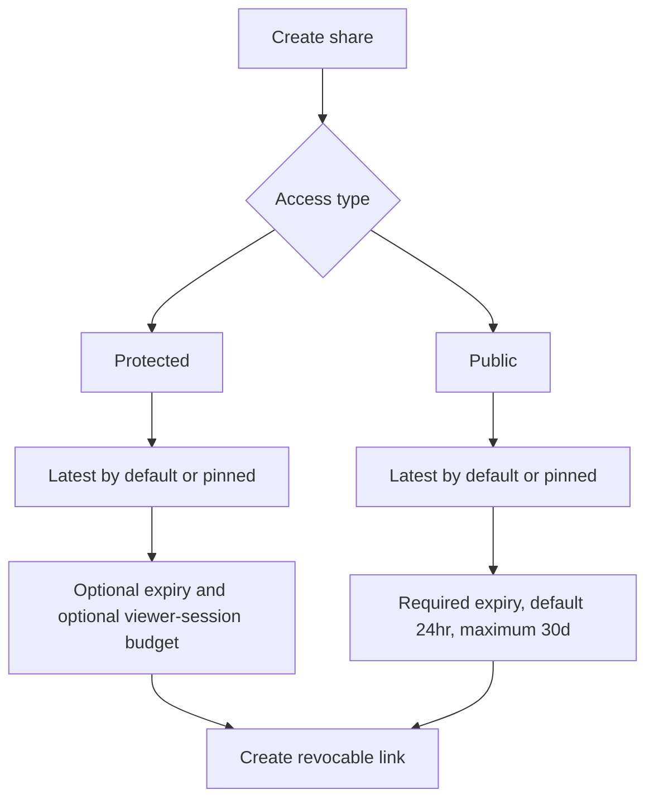
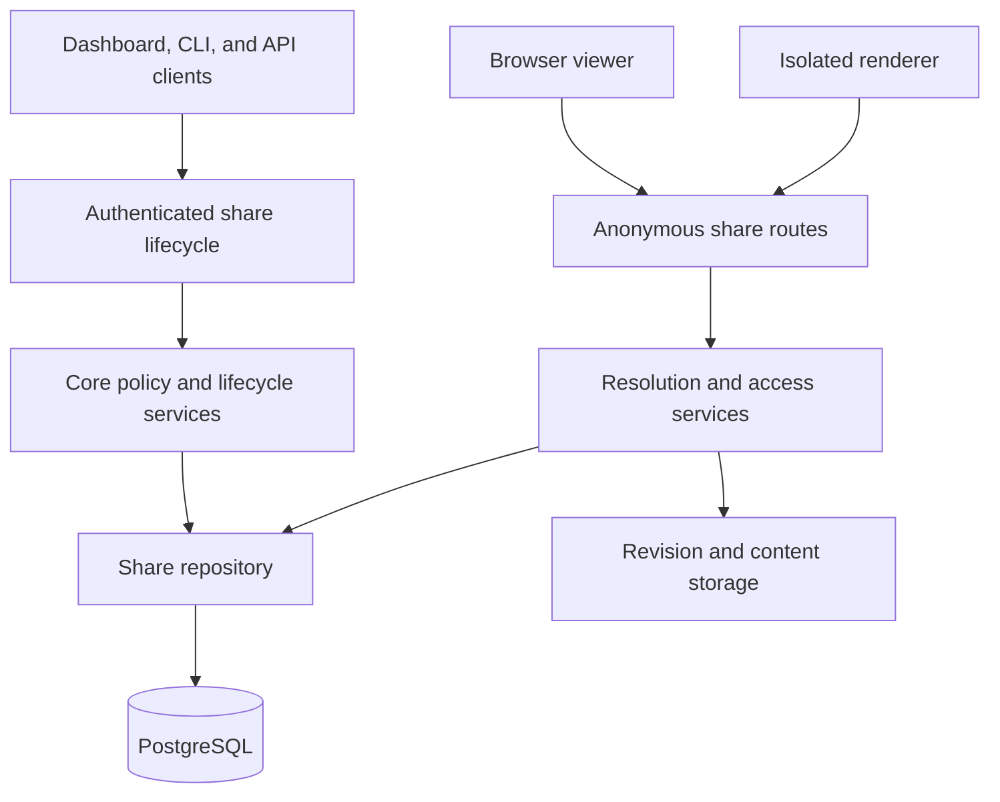
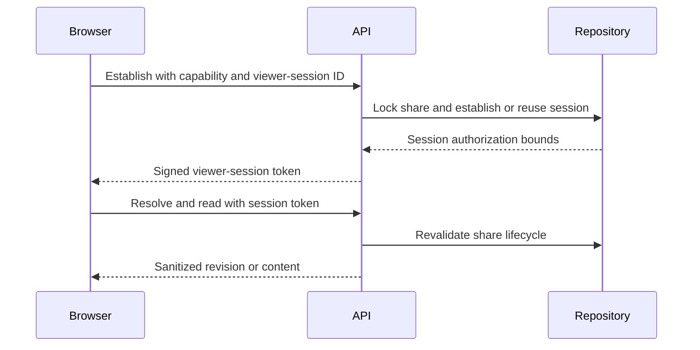
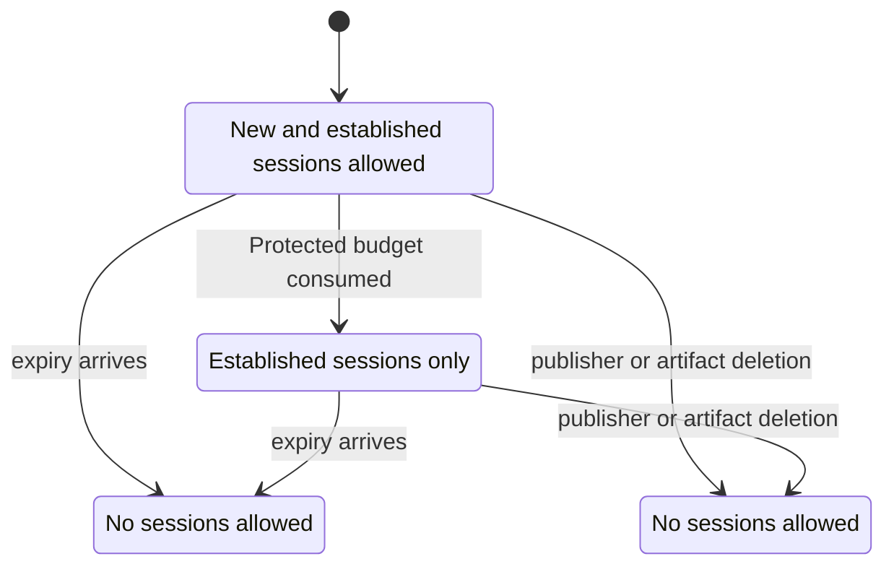
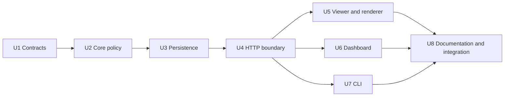

# Share Access Policies - Plan

## Goal Capsule

- **Objective:** Publishers can choose an understandable protected or public sharing policy while retaining independent control over revision targeting, expiry, access limits, and revocation.
- **Means:** Extend Shelf's existing Share lifecycle with explicit Protected and Public link types.
- **Product authority:** This plan owns share access policy and lifecycle behavior. It does not expand Shelf into a public discovery or analytics product.
- **Execution profile:** Cross-cutting security and persistence change with focused contract, core, repository, API, renderer, CLI, and web verification. Full browser E2E is deferred.
- **Stop conditions:** Stop if migration compatibility would change an existing capability URL, if the final Protected session slot can be oversubscribed, or if Public access can bypass its mandatory expiry.
- **Tail ownership:** The implementation includes generated OpenAPI and product decision updates. It does not include a push, pull request, or release.

---

## Product Contract

### Summary

Shelf will offer two explicit link types within one Share lifecycle. Protected links support optional expiry and viewer-session budgets, while Public links are short, unlisted, non-confidential, and always expire within 30 days.

### Problem Frame

Shelf currently offers only an unlisted fragment-capability link. That model protects sensitive content, but its intentionally long URL is awkward when confidentiality does not matter and a normal short link would be easier to distribute.

Expiry also requires entering a date and time for every share. Common duration presets should make temporary sharing the fast path without removing a precise custom option.

### Key Decisions

- **Use two explicit access types within one Share lifecycle.** (session-settled: user-approved — chosen over a policy builder or separate public-publishing system: the security promise stays understandable without duplicating lifecycle management.) Governs R1-R3.
- **Make Public links unlisted and time-bounded.** (session-settled: user-directed — chosen over indexed public publishing: short links are for easy distribution, not discovery.) Governs R6-R8.
- **Count protected access by viewer session.** (session-settled: user-directed — chosen over raw requests or unique-browser tracking: refreshes and internal content requests must not consume the budget.) Governs R4-R5.
- **Keep targeting flexible and default to Latest.** (session-settled: user-directed — chosen over restricting Public links to one target type: publishers may instead pin an exact revision.) Governs R2.
- **Use preset durations before custom date entry.** (session-settled: user-directed — chosen over requiring a date-time value for every expiring share: common lifetimes should take one selection.) Governs R9-R10.

### Actors

- A1. **Publisher:** Creates, inspects, copies, and revokes shares through the dashboard, CLI, or public management API.
- A2. **Viewer:** Opens shared content without an authenticated Shelf account.
- A3. **Shelf:** Enforces the selected access policy without coupling the underlying artifact lifetime to the share lifetime.

### Requirements

**Shared behavior**

- R1. Every new Share must have exactly one access type: Protected or Public.
- R2. Both access types must target Latest or one pinned revision, with Latest selected by default.
- R3. Both access types must remain independently revocable without deleting their retained artifact or revision.

**Protected links**

- R4. A Protected link must require its capability and may independently configure expiry, a maximum viewer-session budget, both constraints, or neither.
- R5. One successful viewer-session establishment must consume one budget unit; refreshes and content requests inside that session must not consume additional units.

**Public links**

- R6. A Public link must use a short normal URL and communicate that its content is accessible to anyone with the URL and is not confidential.
- R7. A Public link must be unlisted, excluded from search indexing, and assigned an expiry no more than 30 days after creation; the 30-day maximum is inclusive.
- R8. Public links must not offer viewer-session budgets, and the default expiry must be 24hr.

**Expiry experience**

- R9. Expiry selection must offer `5m`, `30m`, `2hr`, `6hr`, `24hr`, `3d`, `7d`, `15d`, `30d`, and `Custom`; Protected links must additionally offer `Never` and default to it.
- R10. Selecting a preset must display its calculated expiry instant, while `Custom` must allow a precise future date and time within the policy's permitted range.

**Lifecycle and management**

- R11. Revocation (including through artifact deletion) or expiry must end every viewer session; exhausting a Protected viewer-session budget must block new sessions while established sessions remain usable until their own authorization, the share, or the artifact becomes unavailable.
- R12. Concurrent Protected viewer sessions must never produce more successful establishments than the configured budget; the budget counts establishment IDs, not people, devices, or simultaneous viewers.
- R13. Management surfaces must show access type, target, resolved expiry, lifecycle status, and Protected sessions used, plus sessions remaining for a configured budget or an explicit unlimited indication otherwise, without identifying individual viewers.
- R14. Dashboard, CLI, and API must create every valid policy combination, list its reusable URL and state, and revoke it without requiring the dashboard.
- R15. Existing capability links must retain their current URLs and behavior and be treated as Protected links with no viewer-session budget.
- R16. Protected capability material must remain absent from anonymous responses, errors, logs, and diagnostics; a viewer-session token may appear only in a successful Protected establishment response and must remain absent from every other response and URL.
- R17. Existing `publish --share` behavior must remain Protected, Latest, Never, and unlimited unless the caller explicitly supplies another supported policy.

### Key Flows

- F1. Create a Protected link
  - **Trigger:** A1 chooses Protected while sharing an artifact.
  - **Actors:** A1, A3
  - **Steps:** The publisher selects Latest or a pinned revision, optionally selects an expiry and session budget, reviews the calculated limits, and creates the link.
  - **Outcome:** Shelf returns a capability link governed by the selected constraints.
  - **Covered by:** R1-R5, R9-R10, R14.

- F2. Create a Public link
  - **Trigger:** A1 chooses Public while sharing an artifact.
  - **Actors:** A1, A3
  - **Steps:** The publisher selects Latest or a pinned revision, chooses a required expiry within 30 days, acknowledges the non-confidential promise, and creates the link.
  - **Outcome:** Shelf returns a short unlisted URL that remains valid until expiry or revocation.
  - **Covered by:** R1-R3, R6-R10, R14.

- F3. Establish a protected viewer session
  - **Trigger:** A2 opens a valid Protected link.
  - **Actors:** A2, A3
  - **Steps:** Shelf validates the capability and lifecycle constraints, consumes one available session unit when required, and establishes a viewer session reused by that page's subsequent requests.
  - **Outcome:** The viewer can use the artifact viewer without refreshes exhausting more of the budget.
  - **Covered by:** R4-R5, R11-R12.

- F4. End share access
  - **Trigger:** A share is revoked, expires, exhausts its session budget, or its artifact is deleted.
  - **Actors:** A1, A2, A3
  - **Steps:** Shelf rejects every request after revocation, expiry, or artifact deletion; after budget exhaustion it rejects only new session establishment.
  - **Outcome:** Share revocation, expiry, and budget exhaustion do not delete retained content; artifact deletion makes it unavailable, and an established final session remains usable only until another lifecycle boundary ends it.
  - **Covered by:** R3, R11, R15-R16.

### Acceptance Examples

- AE1. Protected link without limits
  - **Covers R4, R9.**
  - **Given:** A publisher accepts the Protected defaults of Latest, Never, and unlimited sessions.
  - **When:** The share is created.
  - **Then:** It remains available until manually revoked or affected by the artifact lifecycle.

- AE2. Protected link constrained by time and sessions
  - **Covers R4-R5, R11-R12.**
  - **Given:** A Protected pinned link expires in 7d and allows five viewer sessions.
  - **When:** Five sessions establish before the expiry instant.
  - **Then:** The fifth session succeeds and further session establishments fail, while refreshes within an established session do not consume more units.

- AE3. Concurrent final-session attempts
  - **Covers R12.**
  - **Given:** A Protected link has one remaining viewer session.
  - **When:** Two new viewers attempt to establish sessions concurrently.
  - **Then:** Exactly one succeeds.

- AE4. Default Public link
  - **Covers R2, R6-R8.**
  - **Given:** A publisher chooses Public and changes no defaults.
  - **When:** The share is created.
  - **Then:** Shelf returns a short unlisted Latest link expiring in 24hr with no session budget.

- AE5. Public custom expiry beyond the cap
  - **Covers R7, R9-R10.**
  - **Given:** A publisher selects Custom for a Public link.
  - **When:** They choose an instant more than 30 days in the future.
  - **Then:** Shelf refuses creation and explains the 30-day maximum.

- AE6. Latest and pinned behavior
  - **Covers R2.**
  - **Given:** The same artifact has one Latest share and one pinned share.
  - **When:** A new revision becomes latest.
  - **Then:** The Latest share displays the new revision and the pinned share continues displaying its original revision.

- AE7. Existing-link compatibility
  - **Covers R15.**
  - **Given:** A fragment-capability link predates access types and session budgets.
  - **When:** The new policy model is deployed.
  - **Then:** The original URL remains valid under its existing expiry and revocation behavior.

### Scope Boundaries

- Search-indexing opt-in and public discovery surfaces are outside this work; crawler exclusion directives for Public links are in scope.
- Permanent Public links are outside this work; every Public link expires within 30 days.
- Custom short aliases are deferred; Public links receive generated short URLs.
- Password protection and authenticated viewer policies remain separate future decisions.
- Individual viewer identity, location, device tracking, and detailed analytics are outside this work.

### Dependencies and Assumptions

- Shelf continues to treat artifact, revision, and share lifetimes independently.
- A viewer session has a bounded reusable authorization context; its implementation and exact technical lifetime are planning decisions, but closing it and later establishing a new session consumes another budget unit.
- Automated unfurl requests do not consume a Protected session unless they complete viewer-session establishment.
- Selecting Public through the API or CLI is sufficient explicit intent; only the dashboard needs explanatory warning copy.

### Sources and Research

- `packages/contracts/src/shares.ts` — current unlisted capability-only contract and Latest/pinned targeting.
- `packages/core/src/shares/lifecycle.ts` — current capability URL, expiry, and revocation lifecycle.
- `packages/core/src/shares/resolution.ts` — current anonymous resolution and unavailable-state behavior.
- `docs/plans/2026-08-17-0030-feat-shelf-product-plan.md` — product authority for private, unlisted, and Public visibility with indexing as a separate opt-in.

---

## Planning Contract

**Product Contract preservation:** Clarified R11 and F4 without changing scope: reaching a session limit blocks new establishment but cannot invalidate the final session that R5 and AE2 require to succeed. R13-R14 now make existing management parity explicit, and R16-R17 preserve current security and CLI behavior.

### Key Technical Decisions

- KTD1. **Keep visibility and access policy separate.** Both modes remain `unlisted`; a discriminated `accessType` policy owns Protected versus Public behavior. This extends the existing Share aggregate instead of creating a second publishing system. (Implements R1-R3, R6-R8.)
- KTD2. **Use one canonical server-resolved expiry input.** Creation accepts either a named `expiresIn` preset or an absolute `expiresAt`, never both. The semantic request canonicalizes omitted Public expiry to `24hr` and is fingerprinted before clock-dependent validation. An idempotency replay returns the persisted result even after its deadline; only a new request resolves and validates a new instant. (Implements R7-R10, R14.)
- KTD3. **Use a 12-character cryptographically random Public selector.** Store a globally unique 72-bit base64url selector and derive `/s/<selector>` while retaining the internal `shr_…` ID for management. A uniqueness collision rolls back and receives up to three regeneration attempts under the same idempotency namespace; exhaustion is a service failure, not an idempotency conflict. The viewer matches the complete `shr_…` ID grammar first, then the complete selector grammar, and treats every other shape as malformed. (Implements R6-R8, R15.)
- KTD4. **Represent Protected viewer sessions with an idempotent client session ID and a server-issued signed token.** The browser stores the session ID and token in `sessionStorage`. Initial establishment consumes once; retrying against a live idempotency receipt or renewing with the signed token does not. Content authorization lasts at most 24 hours and never beyond share expiry or revocation, while the expired signed token remains valid only as proof for free renewal. (Implements R4-R5, R11-R12, R16.)
- KTD5. **Linearize session establishment on the share row.** One transaction locks the share, rechecks access type and lifecycle, detects a live short-lived idempotency receipt, conditionally increments lifetime `sessionsUsed`, and stores the receipt. It never locks the artifact row, preserving the artifact-first deletion order. Unlimited Protected shares also count establishments and expose null remaining capacity; renewal relies on KTD9 rather than permanent per-session rows. (Implements R5, R11-R13.)
- KTD6. **Preserve v1 idempotency and capability derivation.** Legacy-equivalent Protected requests continue using the v1 fingerprint and existing HMAC capability URL. Public, preset-duration, and session-limited requests use v2 fingerprints accepted by the additive migration. (Implements R15, R17.)
- KTD7. **Expose lifecycle state as a contract, not client inference.** One projector applies exclusive precedence `revoked`, `expired`, `session-limit-reached`, then `active` across create replay, list, revoke, and access. Protected policy fields carry a limit plus lifetime used and nullable remaining counts. (Implements R11, R13-R14.)
- KTD8. **Keep anonymous route meanings explicit.** Existing share-ID anonymous endpoints remain the Protected boundary and add session establishment. Secret-free Public access uses `/api/v1/public/links/:publicCode/*`; `/s/:shareRef` stays the common viewer entry, and anonymous calls omit credentials. (Implements R6, R14-R16.)
- KTD9. **Use a fixed domain-separated viewer-session token.** A versioned bounded token binds `shareId`, `sessionId`, issued-at, access expiry, and purpose under constant-time HMAC verification. Derive it from Shelf's existing durable share-signing key under a separate domain so a process restart preserves validity; key rotation remains an operator migration concern because it already affects capability URLs. Replay within the same session is intentional. An expired valid token may renew only that session after lifecycle revalidation; it cannot mint another session or authorize content. (Implements R5, R11-R12, R16.)
- KTD10. **Collapse security-sensitive anonymous misses.** Syntactically valid missing, revoked, expired, deleted, limit-blocked, wrong-capability, wrong-mode, tampered-token, and cross-share requests return the same unavailable response. Malformed syntax remains validation failure and infrastructure failure remains service failure. (Implements R11-R12, R16.)

### High-Level Technical Design

The diagrams describe boundaries and sequencing, not exact implementation syntax.

### Assumptions

- Protected session limits accept integers from 1 through 1,000,000. This is an API guardrail rather than a product promise about expected traffic volume.
- A 24-hour content authorization bounds direct token replay. Token renewal preserves the same counted session until the share ends; closing the browsing session removes its client state.
- A budget unit corresponds to a client-generated viewer-session ID rather than a person or device. Tabs may inherit or share stored authority and do not map reliably one-to-one to counted sessions; an independently generated ID consumes a new unit.
- Public selectors are non-confidential access locators. High entropy, uniform unavailable responses, expiry, and crawler directives are in scope; a general rate-limiting subsystem is not.
- Authorized list responses continue carrying reusable URLs because the current dashboard and CLI already depend on this behavior.

### System-Wide Impact

- The additive database migration changes a persisted and externally managed contract. Old rows default to Protected with no session limit. The current single-host deployment uses stop-migrate-start ordering so no old process can observe Public rows; multi-instance rollout requires a future enablement gate.
- Viewer session tokens are bearer authority. They must never enter URLs, logs, error envelopes, management results, or renderer diagnostics.
- `X-Robots-Tag: noindex, nofollow, noarchive` applies to viewer documents, anonymous API responses, content, and rendered HTML. This is crawler guidance, not confidentiality.
- OpenAPI, TypeBox runtime validation, CLI response validation, and dashboard guards must evolve together so no client silently accepts a partial policy shape.
- U1-U8 ship as one contract-compatible release in the current single-host deployment. Their order is the implementation sequence, not a set of independently enabled slices, because the persisted discriminant, anonymous routes, generated contract, and clients must agree before Public creation is available.

### Risks and Dependencies

- A read-then-increment session counter can admit too many final sessions. U3 must prove same-ID reuse, different-ID final-slot contention, and deletion contention through independent PostgreSQL connections.
- Deriving a relative expiry before idempotency lookup can move the deadline on replay. U2 must fingerprint the preset and replay the persisted result before resolving a new instant.
- The active HTML renderer currently reuses the Protected capability. U5 must move every viewer and renderer subrequest to the established session token so rendering neither bypasses nor double-consumes limits.
- A malformed migration constraint could strand legacy idempotency records or rewrite URLs. Migration tests must start from the pre-policy schema with real legacy rows.
- Viewer-session receipts exist only for the 24-hour establishment retry window. A bounded opportunistic expiry cleanup and an expiry index keep retained state proportional to recent establishment traffic without decrementing `sessionsUsed`; final share deletion cascades remaining receipts.
- A capability holder can intentionally consume a limited budget, and a high request rate can still create many recent receipts on an unlimited share. This iteration uses short receipt lifetime, bounded cleanup, and database constraints; general request throttling and abuse monitoring remain deployment follow-up work.

### Sequencing

### Sources and Research

- `packages/contracts/src/shares.ts`, `packages/core/src/shares/`, `packages/postgres/src/share-repository.ts`, and `apps/api/src/routes/shares.ts` define the current vertical share boundary.
- PostgreSQL row locks block concurrent updates to a selected row, supporting the final-slot linearization in KTD5: https://www.postgresql.org/docs/current/sql-select.html
- OWASP recommends at least 64 bits of entropy for unguessable session identifiers and a CSPRNG; KTD3 uses 72 bits for a non-confidential Public selector, while Protected viewer session IDs use UUID-strength randomness: https://cheatsheetseries.owasp.org/cheatsheets/Session_Management_Cheat_Sheet.html
- Google documents `X-Robots-Tag` for preventing indexing of both pages and non-HTML responses: https://developers.google.com/search/docs/crawling-indexing/robots-meta-tag

---

## Implementation Units

### U1. Define the share policy contract

- **Goal:** Make valid policy combinations and management state one canonical TypeBox and TypeScript contract.
- **Requirements:** R1-R2, R4, R6-R10, R13-R17; KTD1-KTD2, KTD7.
- **Files:** `packages/contracts/src/shares.ts`, `packages/contracts/test/shares.test.ts`.
- **Approach:** Add access-policy input/result unions, preset values, lifecycle status, Protected usage fields, Public URL validation, and anonymous session-authority schemas. Keep compatibility guards for legacy Protected URLs.
- **Test scenarios:** Accept Protected defaults, expiry-only, limit-only, both limits, Public default/preset/custom expiry, and Latest/pinned targets. Reject conflicting expiry forms, Public session limits, over-cap Public expiry, invalid session bounds, malformed selectors, and cross-mode response shapes.
- **Verification:** Contract guards accept every canonical fixture and reject each invalid combination without widening unrelated schemas.

### U2. Extend core lifecycle and resolution policy

- **Goal:** Create, list, resolve, and report both access types with stable idempotency and lifecycle semantics.
- **Requirements:** R1-R17; KTD1-KTD4, KTD6-KTD10.
- **Files:** `packages/core/src/shares/ports.ts`, `packages/core/src/shares/lifecycle.ts`, `packages/core/src/shares/resolution.ts`, `packages/core/src/shares/access.ts`, `packages/core/src/index.ts`, `packages/core/test/share-lifecycle.test.ts`, `packages/core/test/share-resolution.test.ts`, `packages/core/test/share-access.test.ts`.
- **Approach:** Extend the stored Share aggregate, preserve the legacy fingerprint path, add v2 semantic policy fingerprints, perform replay lookup before clock-dependent work, derive access-aware URLs, centralize status precedence, and require either an established Protected session or a Public selector for anonymous reads.
- **Test scenarios:** Replay legacy and v2 creates with persisted dates and URLs even after expiry; enforce Public defaults/cap and Protected combinations; preserve Latest/pinned behavior; exercise every KTD10 unavailable state; allow an established final session after limit reach; reject a new one; verify revoked-over-expired-over-limit status precedence.
- **Verification:** Core tests demonstrate product acceptance examples without depending on HTTP or PostgreSQL details.

### U3. Add compatible persistence and atomic session establishment

- **Goal:** Persist policy state safely and guarantee that concurrent final-slot attempts admit exactly one new session.
- **Requirements:** R4-R5, R7-R8, R11-R15; KTD3-KTD7, KTD9.
- **Files:** `packages/postgres/src/migrations/0009_share_access_policies.ts`, `packages/postgres/src/migrations.ts`, `packages/postgres/src/database.ts`, `packages/postgres/src/share-repository.ts`, `apps/api/src/adapters/memory-share-repository.ts`, `packages/postgres/test/share-policy-migration.test.ts`, `packages/postgres/test/share-repository.test.ts`.
- **Approach:** Add Protected-compatible defaults, a global partial unique Public selector index, lifetime counters, and a short-lived establishment-receipt table with expiry index and cascading ownership. Delete up to 100 expired receipts for the share before the share-lock transaction; establish under the share-row lock without acquiring an artifact lock; renew from a verified token without repository identity retention; guard rollback when Public, limited, used, receipt, or v2 state cannot be represented.
- **Test scenarios:** Migrate legacy rows and v1 fingerprints byte-for-byte; enforce cross-mode and counter constraints; force a selector collision and retry without orphaned idempotency; race the same live receipt and consume once; renew an expired token without consuming or authorizing content before renewal; race two IDs for one remaining slot; race establishment against artifact deletion without deadlock or post-delete authority; clean expired receipts without changing usage; reject lossy rollback.
- **Verification:** Disposable-PostgreSQL tests prove schema compatibility and concurrency; memory tests prove the same observable contract.

### U4. Expose protected-session and public-link HTTP boundaries

- **Goal:** Serve both anonymous access types without ambiguity or secret leakage.
- **Requirements:** R4-R8, R11-R16; KTD3-KTD5, KTD8-KTD10.
- **Files:** `apps/api/src/share-capability.ts`, `apps/api/src/app.ts`, `apps/api/src/routes/shares.ts`, `apps/api/src/web-app.ts`, `apps/api/openapi/v1.json`, `apps/api/test/share-capability.test.ts`, `apps/api/test/shares.integration.test.ts`, `apps/api/test/openapi.contract.test.ts`.
- **Approach:** Add injectable Public selector generation, the KTD9 token codec, a bounded Protected establishment route, secret-free Public routes, complete crawler/security headers, and KTD10 error projection. Capture logs with production logging enabled; Public selectors may appear because they are non-confidential, but no Protected capability or viewer token may.
- **Test scenarios:** Establish and reuse a Protected session; renew an expired valid token without another budget use; reject expired tokens for content plus modified payload/signature, wrong purpose/session/share, future issuance, malformed and oversized tokens; keep unfurls non-consuming; serve Public content without a secret; assert headers on success and 4xx/5xx; prove sentinel capability and viewer-token values never reach captured logs.
- **Verification:** HTTP integration and OpenAPI contract tests cover each route, response schema, header, and unavailable state.

### U5. Reuse one viewer session across browser and renderer requests

- **Goal:** Make old Protected links and new Public links render through the same viewer without double consumption.
- **Requirements:** R5-R8, R11, R15-R16; KTD4, KTD8-KTD10.
- **Files:** `apps/web/src/capability.ts`, `apps/web/src/api.ts`, `apps/web/src/share-types.ts`, `apps/web/src/viewer-page.tsx`, `apps/web/src/components/artifact-content.tsx`, `apps/web/src/main.tsx`, `apps/renderer/src/app.ts`, `apps/renderer/src/resolver.ts`, `apps/web/test/capability.test.ts`, `apps/web/test/api-boundary.test.ts`, `apps/web/test/viewer-states.test.tsx`, `apps/renderer/test/`.
- **Approach:** Parse either share ID or Public selector, establish Protected authority for one client-generated browsing session, and use its token for resolve, content, tree, download, and rendering. Renderer requests are discriminated: Protected sends `shareId`, viewer token, and nonce; Public sends `publicCode` and nonce. Preserve its exact-body, no-query, no-cookie, origin, CSP, and frame-ancestor checks.
- **Test scenarios:** Open an existing fragment URL, scrub it, refresh without another use, establish an independent session and consume one, render Protected and Public active HTML, reject wrong-mode fields and cross-share replay, recheck revocation/expiry after token issuance, browse Public content without authority, and map terminal failures to one unavailable view. Assert noindex/no-store/no-referrer/nosniff headers on viewer, API, content, and renderer success and failures.
- **Verification:** Focused web and renderer tests prove the credential never enters a URL and every subrequest uses the correct authority.

### U6. Redesign share creation and management UI

- **Goal:** Make access type, target, expiry, and session usage easy to understand in the shared artifact modal and Links inspector.
- **Requirements:** R1-R10, R13-R14; KTD1-KTD2, KTD7.
- **Files:** `apps/web/src/dashboard/share-dialog.tsx`, `apps/web/src/dashboard/artifact-share-dialog.tsx`, `apps/web/src/dashboard/artifact-page.tsx`, `apps/web/src/dashboard/api.ts`, `apps/web/src/dashboard/status.ts`, `apps/web/src/dashboard/dialog.css`, `apps/web/src/dashboard/artifact.css`, `apps/web/test/dashboard-api.test.ts`, `apps/web/test/dashboard-status.test.ts`.
- **Approach:** Put access-type cards first, target second, and policy controls third. Use a pure preset utility for the named durations and calculated instant; reveal a timezone-labelled `datetime-local` only for Custom. Public requires an explicit non-confidential acknowledgment that resets on mode change. Link rows lead with access type and lifecycle badge, then target and expiry, Protected usage, and context-valid copy/revoke actions.
- **Test scenarios:** Verify Protected Never and Public 24hr defaults, every preset, custom past/cap validation and displayed timezone, mode-switch cleanup, blocked Public submission without acknowledgment, Latest/pinned creation, reusable URL copy feedback, status hierarchy, limit usage, and revoke pending/success/failure. Cover initial loading, empty, retryable list failure, create failure without duplicate submission, and preservation of the last confirmed link state after a failed mutation.
- **Verification:** Component-level and pure utility tests cover the state matrix and semantic radio/label/error behavior; manual rendered inspection covers desktop and narrow stacked layouts, keyboard use, focus restoration, announced feedback, spacing, and touch targets without expanding browser E2E.

### U7. Preserve CLI and automation parity

- **Goal:** Let agents create and manage every policy while preserving existing defaults and JSON output.
- **Requirements:** R2, R4, R6-R10, R13-R17; KTD1-KTD2, KTD6-KTD8.
- **Files:** `apps/cli/src/index.ts`, `apps/cli/src/commands/shares.ts`, `apps/cli/src/client.ts`, `apps/cli/src/commands/publish-workflow.ts`, `apps/cli/test/shares.test.ts`, `apps/cli/test/publish-workflow.test.ts`.
- **Approach:** Add `--access`, `--max-sessions`, `--expires-in`, and `--expires-at` with mutual exclusion and server-aligned validation to explicit share creation and to `publish --share`. Keep omitted flags equivalent to legacy Protected behavior and make response URL validation access-aware.
- **Test scenarios:** Create every valid Protected/Public combination; reject invalid cross-mode flags and conflicting expiry inputs; preserve `publish --share`; replay stable resolved expiry and URL; list status/usage; redact capabilities from remote errors.
- **Verification:** CLI tests assert exact request bodies, stable JSON documents, compatibility defaults, and safe redirect/error handling.

### U8. Reconcile product records and complete integration verification

- **Goal:** Keep generated and authored contracts aligned with shipped behavior.
- **Requirements:** R1-R17; KTD1-KTD10.
- **Files:** `README.md`, `docs/plans/2026-08-17-0030-feat-shelf-product-plan.md`, `docs/decisions/README.md`, `docs/operations/authentication.md`, `apps/api/openapi/v1.json`.
- **Approach:** Record the two access policies, corrected management URL behavior, compatibility default, Public non-confidential warning, and the single-host stop-migrate-start rollout order. Regenerate OpenAPI from registered schemas.
- **Test scenarios:** Confirm documented examples match accepted CLI/API inputs and no document calls Public links confidential, permanent, indexed, or analytics-enabled.
- **Verification:** Repository checks pass and a final diff audit accounts for every Product Contract requirement and acceptance example.

---

## Verification Contract

| Gate | Applies to | Done signal |
|---|---|---|
| Focused share tests | U1-U7 | Contract, core, API, renderer, CLI, and web share suites pass with no skipped security or concurrency scenario. |
| Disposable PostgreSQL tests | U3 | Migration compatibility and two-connection final-slot contention pass against `SHELF_TEST_POSTGRES_URL`. |
| `pnpm --filter @shelf/api openapi:generate` | U4, U8 | Generated OpenAPI matches registered runtime schemas with no manual drift. |
| `pnpm typecheck` | U1-U8 | Every workspace compiles against the evolved contract. |
| `pnpm check` | U1-U8 | Biome formatting and lint checks pass. |
| `pnpm build` | U1-U8 | Contracts, core, postgres, API, renderer, CLI, and web production builds complete. |
| Manual rendered inspection | U6 | The shared modal and Links inspector remain readable at desktop and narrow widths; keyboard focus, labels, feedback, and controls remain usable without crowding. |

Full Playwright/browser E2E is not a completion gate for this iteration. Focused integration tests must still cover the security and lifecycle boundaries.

---

## Definition of Done

- Every R1-R17 behavior is represented by a passing contract, service, persistence, boundary, or client test.
- Existing `/s/shr_…#…` URLs remain byte-for-byte derivable and behave as Protected, Latest or pinned, unlimited links according to their stored target and expiry.
- Public links are short, unlisted, non-confidential, secret-free, revocable, non-indexed by directive, and always expire within 30 days.
- Protected budget contention admits exactly one final establishment ID; the budget does not claim to count distinct people, devices, tabs, or simultaneous viewers, and an established final session remains usable until the share ends.
- Dashboard, API, CLI, `publish --share`, renderer, and management listings agree on policy defaults and lifecycle state.
- Capability material never appears in anonymous output; a viewer-session token appears only in its successful establishment response, and neither bearer appears in other responses, URLs beyond the existing fragment capability, errors, logs, or diagnostics.
- Legacy rows and v1 fingerprints remain unchanged after migration; invalid cross-mode rows, duplicate Public selectors, impossible counters, and orphaned session rows are prevented by database constraints.
- Selector collision retry leaves one share and one idempotency result per successful request; migration rollback refuses every persisted state the older schema cannot represent.
- Single-host rollout stops old application processes before migration and starts only the new version before Public creation is enabled; multi-instance enablement remains unsupported in this iteration.
- OpenAPI and product documentation match the shipped contract.
- Focused tests, PostgreSQL checks when configured, typecheck, repository checks, and production build pass; any unavailable gate is reported rather than claimed.
- The final diff contains no abandoned implementation, duplicate policy model, unrelated cleanup, or user-authored change loss.
